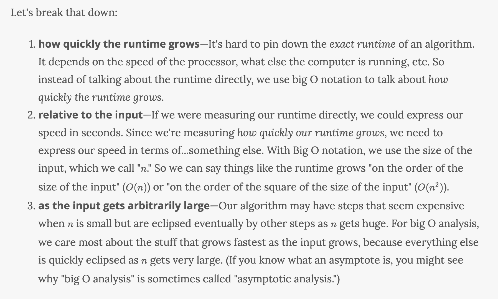
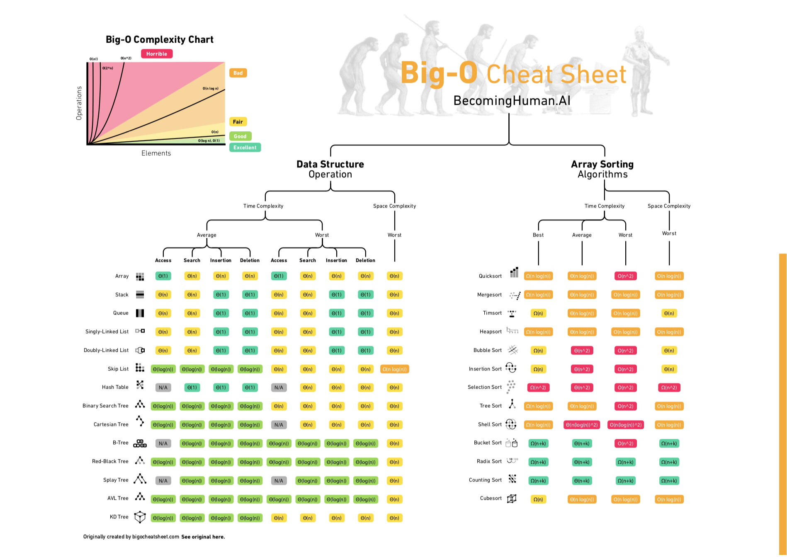
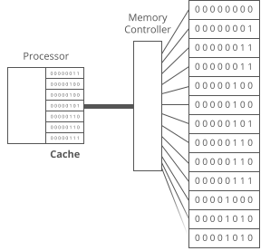

# Efficiency

There are 4 things to keep in mind when choosing or designing an algorithm for computations:

- Memory Use
- Speed
- Accuracy
- Scalability/Parallelisation

Often there will be trade-offs between these categories.

- [Efficiency](#efficiency)
  - [Quantifying efficiency](#quantifying-efficiency)
    - [The rate of increase](#the-rate-of-increase)
  - [Big O Notation](#big-o-notation)
    - [CS50 notes on Big O](#cs50-notes-on-big-o)
    - [Examples](#examples)
  - [Space complexity](#space-complexity)
  - [Memory](#memory)

Efficiency != speed.

We're considering (1) the time it will take to run and (2) the amount of space the program will require in memory.

Often there will be a trade-off between the two, where you can design a program that runs faster by selecting a data structure that takes up more space—or vice versa.

> Efficiency == how well are you using the compute resources to get a job done.

There are common algorithms (procedures or recipes) that can be applied to improve the efficiency of your code in certain situations.

To be an effective problem solver, you'll need to develop the ability to look at a problem and identify different algorithms that could be used—and then contrast those algorithms to consider which will be more or less efficient.

## Quantifying efficiency

Both these functions add 200 to an input, but the first is extremely more efficient.

In the first we're asking Python to perform addition twice, in the second we're asking a hundred times.

```python
def some_function(n):
    for i in range(2):
        n += 100
    return n

def other_function(n):
    for i in range(100):
        n += 2
    return n
```

One element they both have in common, is that the input does not change how many times we perform the addition.

Whereas, something like this, the input will impact our efficiency;

```python
def say_hello(n):
    for i in range(n):
        print("Hello!")
```

> As the input to an algorithm increases, the time required to run the algorithm may also increase.

### The rate of increase

Linear versus exponential

Linear -> as the input increases, the number of lines executed increases by a proportional amount. __The rate of increase in complexity, or resources required, is constant.__

However, let's look at a nested list;

```python
def say_hello(n):
    for i in range(n):
        for i in range(n):
            print("Hello!")
```

This prints "Hello" $n^2$ times.

This is what we would call a quadratic rate of increase.

The _order_ or rate of increase in the run-time of an algorithm is an essential concept when designing algorithms.

> Note, instead of saying "this relationship has a linear rate of increase", we could instead say, "the order of this relationship is linear".


## Big O Notation

"O" in the name refers to the order of the rate of increase.

$O(n)$

$n$ represents the length of the input to your function.

Big O is often used to compare different implementations and decide which one is the most efficient. Technically, with big O notation we express the runtime in terms of how quickly it grows relative to the input, as the input gets arbitrarily large.

From [Interview Cake](https://www.interviewcake.com/article/java/big-o-notation-time-and-space-complexity);



__Reading Big O__

$O(1)$ is just $O(0n + 1)$

What we really care about is how many operations we're asking the processor to perform, not simply the number of lines.

Different lines of code may demand very different numbers of operations from the computer's processor.

Most of the time, when analysing the efficiency of an algorithm, the most important thing to know is the order. In other words, we care a lot about whether the algorithm's time-complexity has a linear order or a quadratic order (or some other order).

This means that very often (in fact, most of the time) when you are asked to analyze an algorithm, you can do so by making an approximation that significantly simplifies things.

`4n^2 + 3n + 7` -> `n^2`

In big O, we drop the constants.

$O(2n)$ becomes $O(n)$

$O(1+n/2+100)$ becomes $O(n)$

For big O notation we're looking at what happens as $n$ gets arbitrarily large. As $n$ gets really big, adding 100 or dividing by 2 has a decreasingly significant effect.

Big O ignores constants, but sometimes the constants matter. If we have a script that takes 5 hours to run, an optimization that divides the runtime by 5 might not affect big O, but it still saves you 4 hours of waiting.

### CS50 notes on Big O

Big O is used to notate the upper bound running time of an algorithm 
- Linear search - $O(n)$
- Bubble sort - $O(n^2)$
- Binary search - $O(\log n)$
- Constant numbers of steps - $O(1)$

Capital omega is used to notate the lower bound running time of an algorithm - $\Omega$
- Linear search - $\Omega(1)$ - you could be lucky and find it straight away
- Bubble sort - $\Omega(n)$ - you have to go through the sequence at least once

When upper bound and lower bound are the same you can use Theta - $\Theta$

Compare sorting algorithms performance, interactive website [here](https://www.cs.usfca.edu/~galles/visualization/ComparisonSort.html)

Cheat sheet available [here](https://www.bigocheatsheet.com/)



Python complexities [here](https://wiki.python.org/moin/TimeComplexity)

### Examples
```python
# O(n)

def say_hello(n):
    for i in range(n):
        print("Hello!")
      
```

```python
# O(n^2)

def Quad_Example(our_list):
    for first_loop_item in our_list:
        for second_loop_item in our_list:
            print ("Items: {}, {}".format
            (first_loop_item,second_loop_item))

  
Quad_Example([1,2,3,4])

%time
```

```python
# O(nlogn)

def Log_Linear_Example(our_list):

    if len(our_list) < 2:
        return our_list

    else:
        mid = len(our_list)//2
        left = our_list[:mid]
        right = our_list[mid:]

        Log_Linear_Example(left)
        Log_Linear_Example(right)

        i = 0
        j = 0
        k = 0

        while i < len(left) and j < len(right):
            if left[i] < right[j]:
                our_list[k]=left[i]
                i+=1
            else:
                our_list[k]=right[j]
                j+=1
            k+=1

        while i < len(left):
            our_list[k]=left[i]
            i+=1
            k+=1

        while j < len(right):
            our_list[k]=right[j]
            j+=1
            k+=1

        return our_list

Log_Linear_Example([56,23,11,90,65,4,35,65,84,12,4,0])

%time
```

```python
# O(log_n)

def Logarithmic_Example(number):
    if number == 0: 
        return 0

    elif number == 1: 
        return 1

    else: 
        return Logarithmic_Example(number-1)
        +Logarithmic_Example(number-2)


Logarithmic_Example(29)

%time
```

```python
# O(1)

def constant(x,y):

    if True:
        z = x + y

   for i in range(10):
        z+=i

  return z


constant(29)

%time
```

The most common Big O functions;

| Name        | Big O | Note  |
| ------------- |:--------:| :--------:|
| constant      | $O(c)$ | the complexity is irrespective of the input|
| linear      | $O(n)$ | complexity scales proportionally with input|
| quadratic | $O(n^2)$ | ignore the constants |
| cubic | $O(n^3)$ | ignore the constants |
| exponential | $O(2^n)$ | the input itself is the exponent |
| logarithmic | $O(\log(n))$ | think divide & conquer; the choice of the next element on which to perform some action is one of several possibilities, and only one will need to be chosen |
| log-linear | $O(nlog(n))$ |

<br>Great Stack Overflow [article](https://stackoverflow.com/questions/2307283/what-does-olog-n-mean-exactly) for understanding $log(n)$.

> O(log n) means time goes up linearly while the n goes up exponentially. So if it takes 1 second to compute 10 elements, it will take 2 seconds to compute 100 elements, 3 seconds to compute 1000 elements, and so on.
>
> ​It is O(log n) when we do divide and conquer type of algorithms e.g binary search. Another example is quick sort where each time we divide the array into two parts and each time it takes O(n) time to find a pivot element. Hence it n O(log n)

## Space complexity

When we refer to space complexity, we are talking about how efficient our algorithm is in terms of memory usage. This comes down to the data types of the variables we are using and their allocated space requirements.

Usually when we talk about space complexity, we're talking about additional space, so we don't include space taken up by the inputs.

It is also important to note that we will be focusing on just the data space being used and not any of the environment or instructional space.

Assume;

| Type        | Storage size           |
| ------------- |:-------------:|
| char      | 1 byte |
| bool      | 1 byte      |
| int | 4 bytes      |
| float | 4 bytes      |
| double | 8 bytes      |

## Memory

Variables are stored in random access memory (RAM). We sometimes call RAM "working memory" or just "memory."

In addition to "memory," your computer has storage (sometimes called "persistent storage" or "disk").

While memory is where we keep the variables our functions allocate as they crunch data for us, storage is where we keep files like mp3s, videos, Word documents, and even executable programs or apps.

Memory (or RAM) is faster but has less space, while storage (or "disk") is slower but has more space.

Think of RAM like a really tall bookcase with a lot of shelves. Like, billions of shelves.

Each shelf has an address, each shelf holds 8 bits (a byte).

A memory controller reads and writes from RAM, each a _direction connection_ to each shelf. There's no need to traverse a list, it can directly access each shelf. (_hence the access is Random Access Memory_)

In order to speed things up further. The processor has a cache where it stores a copy of stuff it's recently read from RAM.


