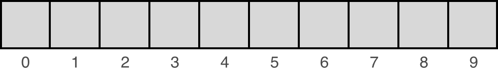

# Data structures

When you write code to solve a problem, there will always be data involved.

How you store or structure that data in the computer's memory can have a huge impact on what kinds of things you can do with it and how efficiently you can do those things.

Take the example of clothes in wardrobe, typically there are two types of people;

(1) Those who fold their clothes and take their time arranging them into the wardrobe, making it easier to pick one out.

(2) Those tho throw their clothes into a pile and deal with finding a specific piece of clothing when they need it.

Both ways work to find your clothes. The first one requires more work up-front, but less when you need to wear something. The second one takes time when it comes to storing them, but makes the operation of finding clothes more challenges.

This is the the trade-off you have to think about when you decide which data structure to use: what is the operation I want to take advantage of?

> A data structure is a pattern for organisaing information -- [enki](https://www.enki.com/)

## Collections

- A group of things
- They don't have a particular order
- They don't have to have objects of the same type

Many data structures are extensions of collections, adding contraints and rules.

### Lists

- Lists have an order
- Have no fixed length

Python’s naming convention doesn’t provide the same level of clarity that you’ll find in other languages. In Java, a list isn’t just a list, it’s either a `LinkedList` or an `ArrayList`.

### Arrays

Arrays are the most common implementation of lists.
<br> Some languages allow for different data types within an array.
<br> Some languages arrays must be of a set size.
<br> The big differentiator between an array and a list is that __arrays have indices, lists do not__.

To understand this, it helps to know how arrays are stored in memory. When an array is created, it is always given some initial size, that is, the number of elements it should be able to hold (and how large each element is). The computer then finds a block of memory and sets aside the space for the array.

_Note; we differentiate between arrays on whether their size is declared up-front (static) or able to change at run-time (dynamic)_

Importantly, the space that gets set aside is one continuous block. That is, all of the elements of the array are contiguous (adjacent, connected without a break, together in a sequence), meaning that they are all next to one another in memory.

In contrast, the elements of a list may or may not be next to one another in memory.
<br>_Linked lists_ for example have each list item pointing to the next list them, but the items themselves may be scattered in different locations of memory.

A Python list is essentially implemented like an array (specifically, it is implemented as a dynamic array). This means a list allows elements to be added or removed, and the list will automatically adjust the backing store that holds these elements by allocating or releasing memory.

The index of an array is like an address in memory


<br>
<br>

Python lists can hold arbitrary elements—everything is an object in Python, including functions. Therefore, you can mix and match different kinds of data types and store them all in a single list.

This can be a powerful feature, but the downside is that supporting multiple data types at the same time means that data is generally less tightly packed.

Python’s `array` module provides space-efficient storage of basic C-style data types like bytes, 32-bit integers, floating-point numbers, and so on.

Arrays created with the `array.array` class are mutable and behave similarly to lists except for one important difference: they’re typed arrays constrained to a single data type.

Because of this constraint, `array.array` objects with many elements are more space efficient than lists and tuples. Like lists they are mutable.

```python
#Python
import array

arr = array.array("f", (1.0, 1.5, 2.0, 2.5))
arr[1]
# output 1.5
```

```C++
// C++
int myArray[] = { 1, 2, 3};
```

```Javascript
// Javascript
let myArray = [1, 2, 3];
```

Python Strings are arrays. They are arrays of bytes representing unicode characters.

Technically, they are "immutable arrays of Unicode Characters". They are immutable because modifying a string requires creating a modified copy.

```python
# Strings can be unpacked into a list to
# get a mutable representation:

list("abcd")
# ['a', 'b', 'c', 'd']

"".join(list("abcd"))
# 'abcd'
```

Strings are also a recursive data structure—each character in a string is itself a str object of length 1

```python
type("abc")
# "<class 'str'>"

type("abc"[0])
# "<class 'str'>"
```

__Doing stuff with arrays__

```python
<!-- no toc -->
# Reversing a string

# approach1
str="Python" # initial string
return str[len(str)::-1]  # slicing 

# approach2
str="Python" # initial string
return ''.join(reversed(str))  # join
```

```python
# Anagrams

# strip() only removes leading and ending whitespace
return sorted(str1.replace(' ','').lower()) == sorted(str2.replace(' ','').lower())
```

```python
# Reverse the words in a sentence

# approach1
return ''.join([''.join(reversed(i)) + ' ' for i in our_string.split()]).strip()

# approach2
word_list = our_string.split(" ")

for idx in range(len(word_list)):
        word_list[idx] = word_list[idx][::-1]

    return " ".join(word_list)
```

```python
"""
In information theory, 
the Hamming distance between two strings of equal length, is;
the number of positions at which the corresponding symbols are different.

Calculate the Hamming distance for the following test cases.
"""

def hamming_distance(str1: str, str2: str) -> int:
    hamming_distance = 0
    if len(str1) != len(str2):
        return None
    else:
        for i in range(len(str1)):
            if str1[i] != str2[i]:
                hamming_distance += 1

    return hamming_distance
```

### Linked lists

In higher level programming languages there often isn't a distinction between arrays and linked lists.

However, a list in an _abstract data type_

> Abstract data type is a definition of a data type (or a data structure) that only mentions what operation are to be performed but not how these operations will be implemented.

> Lists are linear (rather than hierarchical, all elements are on the "same level").

Whereas an array can be thought of as a set of elements that are stored in memory contiguously (one after the other, in sequence).

A linked list, takes this one step further, the elements are not just stored in order but linked to one another (think of a paper chain, or a conga line). A linked list is an extension of a list and is not an array.


<br>
<br>

There no are indices in a linked list, it is categorised by its links. Each element has some notion of what the next element is, not necessarily how long the list is, or where it is in the list. Each _node_ in the list is referenced in relation to other nodes.

In array however, you know what the next element is by what the next index is.

In an array you store the value and its index. In a linked list you store the value and "next" -> the memory location of the next item.

You can only join the list by "disturbing" the nodes at the head or tail. You can't index and slice into the linked list.

A linked list has; (1) nodes and (2) references to the next node (rather than an index) and as such do not need to be stored continuously in memory.

The first node is the `head`. The last node has a reference to `None`.

Adding and removing elements from an array can be complicated, every element essentially "moves". Whereas this is much easier in a linked list.

In linked lists you add an element by simply changing the `next` reference;

> Note, in the example below you should always;

> assign your next pointer to "2" to "6"

> before changing "8" from "6" to "2",

> otherwise you'll lose your reference

_Note, insertion takes constant time $O(n)$ as you're just shifting pointers, not iterating over every element in the list_


<br>
<br>

__Doubly linked lists__

In Doubly Linked Lists, each element references to the next and previous element.


<br>
<br>

__Implementing a linked list in Python__

```python
class Node:
    def __init__(self, value):
        self.value = value  # date we want to assign to the node
        self.next = None  # ref to next node in the list

head = Node(2)  # 2 is the value we want to hold

# adding a new element
new_node = Node(1)  # we initialise the new node
head.next = new_node  # we must store the new node as a ref to the previous node

# really we should do it in one step
head.next = Node(1)

# we'll access nodes through their links, not directly
print(head.next.value)
```
<br>
<br>

Our goal is to extend the list until it looks like this:


```python
class Node:
    def __init__(self, value):
        self.value = value
        self.next = None

head = Node(2)
head.next = Node(1)
head.next.next = Node(4)
head.next.next.next = Node(3)
head.next.next.next.next = Node(5)
```

What if we had a list with 1,000 nodes?
```python
def traverse_linkedlist(head: Node) -> Node:
    current_node = head

    while current_node is not None:
        print(current_node.value)
        current_node = current_node.next
```

Creating a linked list using iteration
```python
def create_linked_list(input_list):
    head = None
    for value in input_list:
        if head is None:
            head = Node(value)    
        else:
        # Move to the tail (the last node)
            current_node = head
            while current_node.next:
                current_node = current_node.next

            current_node.next = Node(value)
    return head
```

```python
# a more efficient solution
def create_linked_list_better(input_list):

    head = None
    tail = None

    for value in input_list:

        if head is None:
            head = Node(value)
            tail = head # when we only have 1 node, head and tail refer to the same node
        else:
            tail.next = Node(value) # attach the new node to the `next` of tail
            tail = tail.next # update the tail

    return head
```

Usually you'll want to create a `LinkedList` class as a wrapper for the nodes themselves and to provide common methods that operate on the list.

For example you can implement an append method that adds a value to the end of the list.

_Note that if we're only tracking the head of the list, this runs in linear time_;  $O(N)$  , since you have to iterate through the entire list to get to the tail node. However, prepend-ing (adding to the head of the list) can be done in constant  $O(1)$ time. 

```python
class LinkedList:
    def __init__(self):
        self.head = None

    def append(self, value):
        if self.head is None:
            self.head = Node(value)
            return

        # Move to the tail (the last node)
        node = self.head
        while node.next:
            node = node.next

        node.next = Node(value)
        return

    def to_list(self):
        out_list = []

        node = self.head
        while node:
            out_list.append(node.value)
            node = node.next

        return out_list
```

### Doubly linked list

This type of list has connections backwards and forwards through the list.


```python
class DoubleNode:
    def __init__(self, value):
        self.value = value
        self.next = None
        self.previous = None
```

### Circular linked list

Circular linked lists occur when the chain of nodes links back to itself somewhere.

For example `NodeA -> NodeB -> NodeC -> NodeD -> NodeB` is a circular list because `NodeD` points back to `NodeB` creating a loop `NodeB -> NodeC -> NodeD -> NodeB`. 

> A circular linked list is typically considered pathological because when you try to iterate through it, you'll never find the end.


## Dynamic arrays versus LinkedLists

--TODO

No data structure is well suited for all circumstances.

A good example to see the difference is the implementation of the Josephus problem.

If you consider the people in the circle being a connected list of nodes, then the deletion is easy.

However, the list will not excel at finding the next person to delete because it has to iterative through n nodes.

In contrast to the list, deletion in dynamic arrays implies shifting the other elements to maintain the internal structure. Yet, finding the nth person is easier by referencing their position directly.

### Linked list practice

--TODO write up better notes on this section, referring to `linked_lists.py`

Your `LinkedList` class should be able to:

+ Append data to the tail of the list and prepend to the head
+ Search the linked list for a value and return the node
+ Remove a node
+ Pop, which means to return the first node's value and delete the node from the list
+ Insert data at some position in the list
+ Return the size (length) of the linked list

```python
class Node:
    def __init__(self, value):
        self.value = value
        self.next = None

class LinkedList:
    def __init__(self):
        self.head = None

    def to_list(self):
        out = []
        node = self.head
        while node:
            out.append(node.value)
            node = node.next
        return out
```

Create a function to prepend to linked list

```python
# Define a function outside of the class
def prepend(self, value):
    """ Prepend a value to the beginning of the list. """
    if self.head is None:
        self.head = Node(value)
    else:
        previous_head = self.head
        self.head = Node(value)
        self.head.next = previous_head


# This is the way to add a function to a class after it has been defined
LinkedList.prepend = prepend

# Test prepend
linked_list = LinkedList()
linked_list.prepend(1)

assert linked_list.to_list() == [1], f"list contents: {linked_list.to_list()}"
```

### Detecting loops in linked lists

To detect if a loop exists within a linked list we use two pointers, called "runners".

The pointers move through the list at different rates.

Typically we have a "slow" runner which moves at one node per step and a "fast" runner that moves at two nodes per step.

If a loop exists in the list, the fast runner will eventually move behind the slow runner as it moves to the beginning of the loop.

Eventually it will catch up to the slow runner and both runners will be pointing to the same node at the same time. If this happens then you know there is a loop in the linked list.


```python
class Node:
    def __init__(self, value):
        self.value = value
        self.next = None

class LinkedList:
    def __init__(self, init_list=None):
        self.head = None
        if init_list:
            for value in init_list:
                self.append(value)

    def append(self, value):
        if self.head is None:
            self.head = Node(value)
            return

        # Move to the tail (the last node)
        node = self.head
        while node.next:
            node = node.next

        node.next = Node(value)
        return
```

```python
list_with_loop = LinkedList([2, -1, 3, 0, 5])

# Creating a loop where the last node points back to the second node
loop_start = list_with_loop.head.next

node = list_with_loop.head
while node.next:
    node = node.next
node.next = loop_start
```

Implement a function that detects if a loop exists in a linked list.

```python
def iscircular(linked_list):
    """
    Determine whether the Linked List is circular or not

    Args:
       linked_list(obj): Linked List to be checked
    Returns:
       bool: Return True if the linked list is circular, return False otherwise
    """
    if linked_list.head is None:
        return False

    slow = linked_list.head
    fast = linked_list.head
    # doing just while fast, you can reach the end and hit an attribution error
    while fast and fast.next:
        # slow pointer moves one node
        slow = slow.next
        # fast pointer moves two nodes
        fast = fast.next.next

        if slow == fast:
            return True

    # If we get to a node where fast doesn't have a next node or doesn't exist itself,
    # the list has an end and isn't circular
    return False
```
