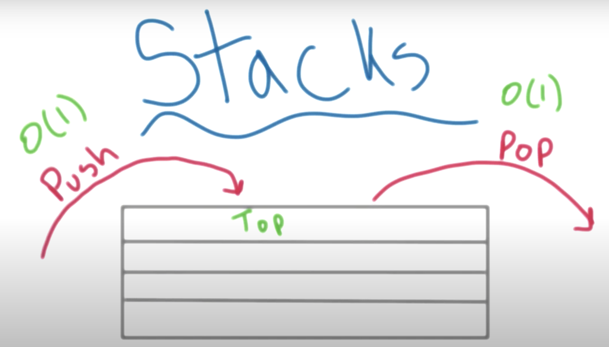
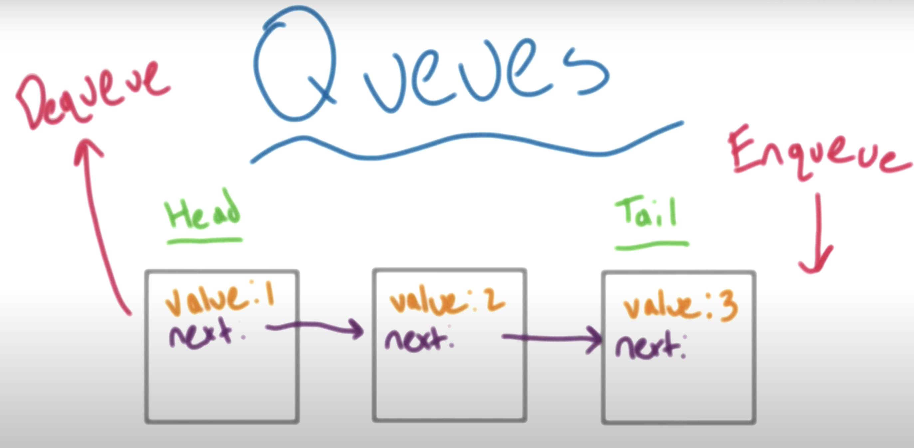

# Stacks and Queues

## Stacks

Stacks are list-based data structures.

__The main idea__

Stacks are like a stack fo objects in real life. You keep putting elements on top and you have easy access to remove or inspect the element on the top.

The element at the bottom is harder to access. You must make your way through everything above it, to reach it.

The element at the bottom is the earliest thing put in the stack.

Stacks are useful when to commonly want to access the most recent element and/or want to maintain the integrity in which you added things to the list.

In a newsfeed for example, you will what the most recent element first, and provide additional elements as the user works through the feed.

Stacks are a `LIFO` data structure -> last-in, first-out.

Stacks have specific terminology.

When you add to a stack you `push`, when you remove from a stack you `pop`. 

As we only look at the top element of the stack, both operations will be performed in constant time $O(1)$



Performance-wise, a proper stack implementation is expected to take $O(1)$ time for insert and delete operations.

A stack is abstract and can be implemented with other data types, it does not have to be implemented using a list.

The type of each element and how they're connected is not specified. Only the methods for adding and removing elements are specified.

You could use a LinkedList to implement a stack. Keeping track of the front or head of the list and keep adding elements on top as you go.

## Implementing a stack using an array

In both stacks and arrays, we have a collection of elements and these elements have an order to them.

However, in an array we can access any element using its index.

In order to implement a stack using an array, we can think of stacks as a container, where we can only access it from one end. Therefore we need to restrict the ways in which we can interact with the array.

Our goal will be to implement a `Stack` class that has the following functionality:

1. `push` - adds an item to the top of the stack
2. `pop` - removes an item from the top of the stack (and returns the value of that item)
3. `size` - returns the size of the stack
4. `top` - returns the value of the item at the top of stack (without removing that item)
5. `is_empty` - returns `True` if the stack is empty and `False` otherwise

```python
<!-- no toc -->
class Stack:

    # initialise a number of attributes
    def __init__(self, initial_size = 6):
        self.arr = [None for _ in range(initial_size)]  # think of this as creating an empty container we'll put the stack in
        self.next_index = 0  # keeps track of the top of the stack
        self.num_elements = 0

    def push(self, item):

        if self.next_index == len(self.arr):
            self._handle_stack_capacity_full()  # we have the call the method on its self

        self.arr[self.next_index] = item  # assign the item to the head of the stack
        self.next_index += 1  # increment where the index where the next item will go
        self.num_elements += 1

    def _handle_stack_capacity_full(self):
        old_arr = self.arr
        self.arr = old_arr + [None for _ in range(len(old_arr))]
        # cannot do old_arr.extend([new list])

    def size(self):
        return self.num_elements

    def is_empty(self):
        return True if  self.num_elements == 0 else False
        # return self.num_elements == 0

    def pop(self):
        if self.is_empty():
            self.next_index = 0  # should already be true but good practice
            return None
        self.next_index -= 1
        self.num_elements -= 1
        return self.arr[self.next_index]  # we've removed one from the index ref so it now returns last element in the array

foo = Stack()
foo.push('test')
foo.push('42')
foo.push('fish')

assert foo.arr == ['test', 42, 'fish', None, None, None]
```

## Implementing a stack using a linked list

Using a linked list should reduce our time complexity, because we don't need to worry about checking the empty capacity of the array that acts as a container for our stack.

With our linked list implementation, `pop` and `push` have a time complexity of $O(1)$. There's no traversal, just changing pointers.

With an array, we had to specify some initial size (in other words, we had to set aside a contiguous block of memory in advance). But with a linked list, the nodes do not need to be contiguous. They can be scattered in different locations of memory, an that works just fine. This means that with a linked list, we can simply append as many nodes as we like. Using that as the underlying data structure for our stack means that we never run out of capacity, so pushing and popping items will always have a time complexity of $O(1)$.

```python
class Node():
    def __init__(self, value):
        self.value = value
        self.next = None
        # we don't need to worry about an index,
        # we reference elements through their relation with other nodes

class Stack:
    def __init__(self):
        self.head = None
        self.num_elements = 0

    def push(self, value):
        new_node = Node(value)  # create a new Node with the value passed in

        if self.head is None:  # if empty
            self.head = new_node
        else:
            new_node.next = self.head  # point our new node to the head node
            self.head = new_node  # reassign the head variable of the LinkedList to the new node

        # we could add to the tail of the list
        # however, we have to traverse the whole list to get to the top of the stack
        # else:
        #     current_node = head  # set our starting point
        #     while current_node.next:  # loop through the whole list
        #         current_node = current_node.next
        #     current_node.next = new_node  # set our new node to the end

        self.num_elements += 1

    def size(self):
        return self.num_elements

    def is_empty(self):
        return self.head is None
        # self.num_elements == 0

    def pop(self):
        if self.is_empty():
            return None

        to_pop = self.head
        self.head = self.head.next
        self.num_elements -= 1
        return to_pop

```

## Python's built-in stacks

Python comes with "batteries included". It's easier for us to implement a stack using existing `list()` methods.

```python
class Stack:
    def __init__(self):
        self.items = []

    def size(self):
        return len(self.items)

    def push(self, item):
        self.items.append(item)

    def pop(self):
        if self.size()==0:
            return None
        else:
            return self.items.pop()
```

We don't have to keep track of the index because Python's lists are implemented as dynamic arrays.

The list over-allocates its backing storage so that not every push or pop requires resizing. As a result, you get an amortized O(1) time complexity for these operations.

[Real Python](https://realpython.com/python-data-structures/#stacks-lifos):

> To get the amortized O(1) performance for inserts and deletes, new items must be added to the end of the list with the append() method and removed again from the end using pop().

> Adding and removing from the front is much slower and takes O(n) time, as the existing elements must be shifted around to make room for the new element. This is a performance anti-pattern that you should avoid as much as possible

## Queues

Queues, are the flip of stacks, there are a `FIFO` first-in, first-out data structure.

The first, or oldest element in a queue is the `head`. The last, or newest element in a queue is the `tail`.

Like stacks, queues have specific terminology and methods associated with them.

Adding an element to the queue is to `enqueue`, removing an element is to `dequeue`. We can only add data to the back/tail of the queue, we can only remove data from the front/head of the queue.

This is in contrast to a `stack` where the entry and exit point is the same.

You can also `peek`, to see what value is contained at the head, without removing it.

Unlike lists or arrays, queues typically don’t allow for random access to the objects they contain.

Performance-wise, a proper queue implementation is expected to take $O(1)$ time for insert and delete operations.



There are two special types of queues that show up often;

(1) __Deck__ - a double ended queue, you can enqueue or queue from either end.

Really a deck is a generalised view of both stacks and queues as you could represent either of them with it.

(2) __Priority Queue__ - you assign each element a numerical priority when you insert it into the queue, when you dequeue, you remove the element with the highest priority. However, where elements have the same priority, the oldest element is dequeued first.

In a priority queue the the priority is stored as a key. Instead of retrieving the next element by insertion time, it retrieves the highest-priority element. The priority of individual elements is decided by the order applied to their keys.

## Implementing a queue using an array

The array will act as a a container or wrapper for our queue.

We must define the head and tail of the queue in order to ensure the array behaves like a queue.

When we add (enqueue), we want to the next free index, so we need to keep track of this.

When we dequeue data, the front of the queue is going to move. Rather than re-index everything in the array, we'll want to "wrap around". For example, say we dequeued two elements from index 2 is now the head of our queue, rather than set the head to 0 and shuffle all element down, we'll want index 1 to represent the tail. We could continuously expand the memory used by the queue but this becomes extremely wasteful.

Our goal will be to implement a `Queue` class that has the following functionality:

1. `enqueue`  - adds data to the back of the queue
2. `dequeue`  - removes data from the front of the queue
3. `front`    - returns the element at the front of the queue
4. `size`     - returns the number of elements present in the queue
5. `is_empty` - returns `True` if there are no elements in the queue, and `False` otherwise
6. `_handle_full_capacity` - increases the capacity of the array, for cases in which the queue would otherwise overflow

Also, if the queue is empty, `dequeue` and `front` operations should return `None`.

```python
class Queue:
    def __init__(self, initial_size = 10):
        self.arr =[None for _ in range(initial_size)]
        self.next_index = 0  # where the item will be added when we enqueue
        self.front_index = -1  # where the item will be removed from when we dequeue
                               # set to -1 because our queue is empty, there is nothing at index 0
                               # there is nothing that can be removed, -1 denotes this
        self.queue_size = 0

    def enqueue(self, value):
        if self.queue_size == len(self.arr):  # check to see if we can wrap or need to extend the size
            self._handle_queue_capacity()

        # enqueue new element
        self.arr[self.next_index] = value
        self.queue_size += 1
        # we increment the index but have to divide but the len
        # because we will wrap the index
        # if we have an array of 10, and the next index would be 11
        # but the early elements of the index are free as elements have been dequeued
        # then 11 % 10 = 1, and we can use that index
        # we are recycling the slots
        self.next_index = (self.next_index + 1) % len(self.arr)
        if self.front_index = -1:
            self.front_index = 0

    def dequeue(self):
        if self.is_empty():
            # reset pointers
            self.front_index = -1
            self.next_index = 0
            return None

        value = self.arr[front_index]
        # allows us to recycle indices
        # advance the front index to point at the next item
        self.front_index = (self.front_index + 1) % len(self.arr)
        self.queue_size -= 1
        return value

    def size(self):
        return self.queue_size

    def is_empty(self):
        return queue_size == 0

    def front(self):
        if self.is_empty():
            return None
        return self.arr[front_index]

    def _handle_queue_capacity(self):
        old_arr = self.arr  # take a copy of the existing array
        self.arr = [None for _ in range(2 * len(old_arr))]  # create an array twice that of the old array

        index = 0

        # we're going from the front of the queue, to the end of the array
        # we cannot just add the old and new array together
        # we may have dequeued items we want only insert remaining items into the new array
        # this may be halfway through the old array
        for i in range(self.front_index, len(old_arr)):
            self.arr[index] = old_arr[i]
            index += 1  # continuously track the furtherest index

        # this along may not copy all the index as the index is wrapped
        # if the front-index is ahead of the next-index we need to grab these items as well
        if i in range(0, self.front_index):
            self.arr[index] = old[i]
            index += 1

        # reset pointers
        self.front_index = 0
        self.next_index = index
```

## Implementing a queue using a linked list

We'll use the head of the linked list as the front of the queue, and the tail as the back of the queue.

To enqueue a new item, we'll create a new node and attach it to the tail.

To dequeue an item, we'll take the head node and shift the head reference to the next node.

```python
class Node():
    def __init__(self, value):
        self.value = value
        self.next = None

class Queue():
    def __init__(self):
        self.head = None
        self.tail = None
        self.num_elements = 0

    def enqueue(self, value):
        new_node = Node(value)

        if self.head is None:
            self.head = new_node
            self.tail = self.head
        else:
            self.tail.next = new_node  # add the new item to the tail
            self.tail = self.tail.next  # change the ref of tail

        self.num_elements += 1

    def dequeue(self):
        if self.is_empty():
            return None

        value = self.head.value  # return the value attribute of the head node
        self.head = self.head.next
        self.num_elements -= 1
        return value

    def size(self):
        return self.num_elements

    def is_empty(self):
        return self.num_elements == 0
```

When we use `enqueue`, we simply create a new node and add it to the tail of the list. And when we `dequeue` an item, we simply get the value from the head of the list and then shift the `head` variable so that it refers to the next node over.

Both of these operations happen in constant time—that is, they have a time-complexity of $O(1)$.

## Python's built-in objects

Python has a built-in `deque` object that is implemented as a doubly-linked list. This allows you to add and remove elements from both the head and the tail.

The `deque` object can therefore be implemented as either a queue or as a stack.

> Python’s deque objects are implemented as doubly-linked lists, which gives them excellent and consistent performance for inserting and deleting elements but poor O(n) performance for randomly accessing elements in the middle of a stack.

```python
from collections import deque

# stack
s = deque()
s.append("eat")
s.append("sleep")
s.append("code")

s.pop()  # output: 'code'

# queue
q = deque()
q.append("eat")
q.append("sleep")
q.append("code")

q.popleft()  # output: 'eat'
```

Python also as a `LifoQueue` object. The object supports multiple concurrent producers and consumers interacting with the stack (parallel processing).

```python
from queue import LifoQueue

s = LifoQueue()

s.put("eat")
s.put("sleep")
s.put("code")

s  # output: <queue.LifoQueue object at 0x108298dd8>

s.get()  # output: 'code'
```

For queue module also contains `Queue`, again useful in parallel computing.

The methods are the same as the `LifoQueue` object.

```python
from queue import Queue
```

--TODO

[] Create an `__init__.py` file in the folders `array`, `linked_list`, `stack` and `queue` which holds the base class
[] Example can be found [here](https://github.com/TheAlgorithms/Python/tree/master/data_structures/linked_list)

## Using stacks and queues

Note
```text
Stacks have a wide range of uses in algorithms. For example, they’re used in language parsing as well as runtime memory management, which relies on a call stack. A short and beautiful algorithm using a stack is depth-first search (DFS) on a tree or graph data structure.

Queues have a wide range of applications in algorithms and often help solve scheduling and parallel programming problems. A short and beautiful algorithm using a queue is breadth-first search (BFS) on a tree or graph data structure.

Scheduling algorithms often use priority queues internally. These are specialized queues. Instead of retrieving the next element by insertion time, a priority queue retrieves the highest-priority element. The priority of individual elements is decided by the queue based on the ordering applied to their keys.

Priority queues are commonly used for dealing with scheduling problems. By organizing pending tasks in a priority queue that uses task urgency as the key, the task scheduler can quickly select the highest-priority tasks and allow them to run first.
```

## Call stacks

When we use functions in our code, the computer makes use of a data structure called a `call stack`.

A call stack is a type of stack - it is a Last-In, First-Out (LIFO) data structure.

A call stack is a stack of frames that are used for the functions that we are calling.

When we call a function, say `print_integers(5)`;

- a frame is created in memory
- all the variables local to the function are created in this memory frame
- as soon as this frame is created, it's pushed onto the call stack
- the frame that lies at the top of the call stack is executed first 
- as soon as the function finishes executing, this frame is discarded from the call stack

consider;
```python
def add(num_one, num_two):
    output = num_one + num_two
    return output

result = add(5, 7)  # 12
```

_Note;_ it is important to remind ourselves that;

Whenever an expression such as product = 5 * 7 is evaluated, the right hand side of the = sign is evaluated first the result is then stored in the variable name mentioned in the left-hand side.

When Python executes `result = add(5, 7) ` the following things happen in memory:

(1) A frame is created for the add function.<br>
This frame is then pushed onto the call stack. We do not have to worry about this because Python takes care of this for us.

(2) The parameters `num_one` and `num_two` get the values 5 and 7, respectively.

(3) Python then moves on to the first line of the function. `output = num_one + num_two`

(4) Once the right-hand side is completely evaluated, then the assignment operation happens.<br>
i.e. now the result of 5 + 7 will be stored in the variable `output`.

(5) Python returns `output`<br>
Now the last line of the function has been executed.<br>
Therefore, this function can now be discarded from the stack frame.<br>

This flow is akin to a stack as the last element inserted in the stack is the first to be removed.

http://pythontutor.com/ is a great resource to visualise code being executed.

### Call stack order of operation

Lets take a second example, with two functions.

```python
def add(num_one, num_two):
    output = num_one + num_two
    custom_print(output, num_one, num_two)
    return output

def custom_print(output, num_one, num_two):
    print(f"The sum of {num_one} and {num_two} is: {output}")

result = add(5, 7)
```

When the `add` function is called using `result = add(5, 7)`, a frame is created in the memory for the `add()` function.

This frame is then pushed onto the call stack.

Next, the two numbers are added and their result is stored in the variable `output`.

On the next line we have a new function call - `custom_print(output, num_one, num_two)`.

A new frame is created for this function call as well. This new frame is now pushed into the call stack.

The `custom_print()` function sits at the top of the call stack, and will be executed first.

The frame for `custom_print(output, num_one, num_two)` is then discarded.

Now, again the frame for `add()` function is at the top of the call stack.

Python resumes the operation after the line where it had left and returns the `output`.
