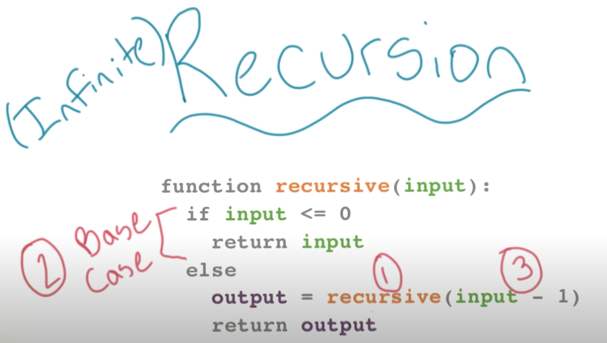
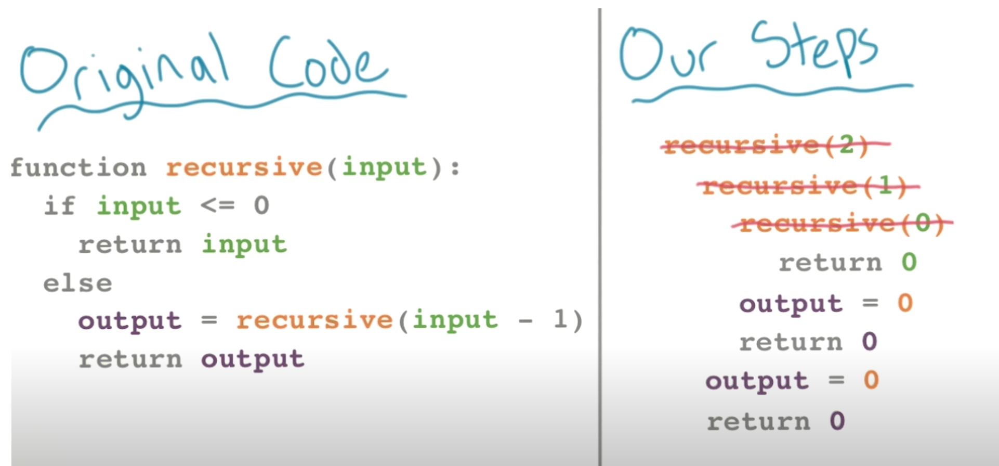
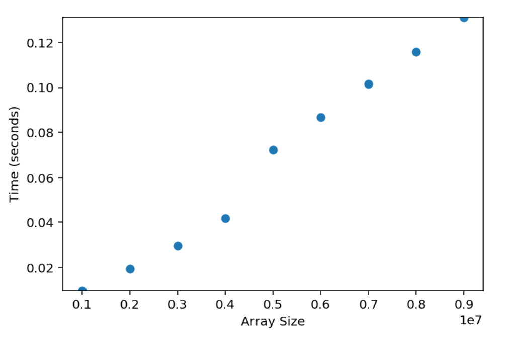
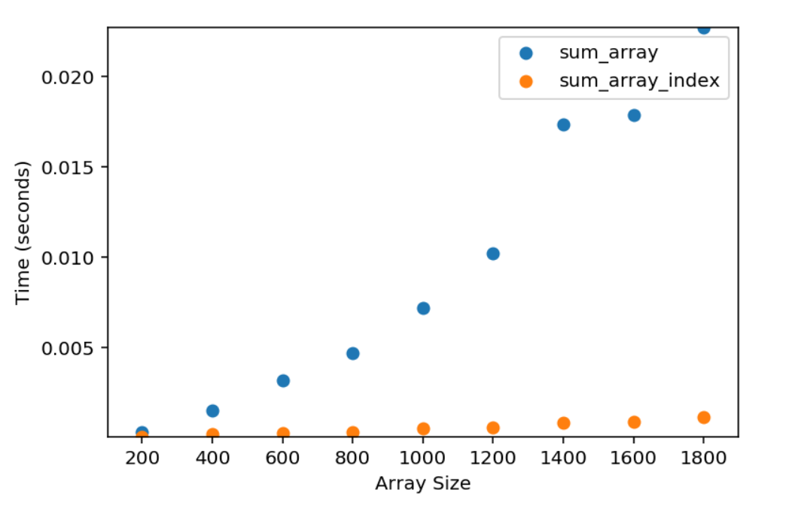

# Recursion

Recursion isn't just about repetition

With recursion, we solve a problem by first solving smaller instances of the same problem.

Consider the problem of calculating $\mathtt{2^5}$. Let's assume to calculate this, you need to do one multiplication after another. That's $2 * 2 * 2 * 2 * 2$. We know that $2^5 = 2 * 2^4$. If we know the value of $2^4$, we can easily calculate $2^5$.

Notice, the problem on the right ($2^4$) is a subset of $2^5$

We can use recursion to solve this problem, since the solution to the original problem ($2^n$) depends on the solution to a smaller instance ($2^{n-1}$) of the same problem. The recursive solution is to calculate $2 * 2^{n-1}$ for all n that is greater than 0. If n is 0, return 1.

A more concrete example, might come in "how to read a book". Think of the book as a list of pages. We have to read one page today and the rest tomorrow. So the task tomorrow is to read a smaller version of the book.

In practice, this often involves calling a function from within itself. In other words, we feed some input into the function, and the function produces some output—which we then feed back into the same function. And we continue to do this until we arrive at the solution.

(1) A recursive function must call itself <br>
But the recursive function will call itself on a smaller version of the same problem.

(2) A recursive function needs a base case, similar to a `while loop`, you keep going through some code until you hit an exit condition. The base case lets you know when you need to stop. Without it, you may get stuck in _infinite recursion_. <br>
The base case is the smallest instance of the same problem.

(3) A recursive function should alter the input parameter. You must change each time you iterate, otherwise you may get stuck in _infinite recursion_. <br>
i.e. ensure you are breaking down the problem appropriately.



The flow in the code below;

- We start with the `if` statement, we evaluate that 2 is greater than 0 so we move to the else statement
- __Before assigning anything to the variable `output` we call the recursive function on `input - 1`__ {important bit}
- Again, we see that 1 is still greater than 0 so move to the else statement
- We run the function on `input - 1`, which is now 0
- The `if` function evaluates to `True` and we return the input 0
- 0 is now out output and returned to the other two functions that still have not yet been completed
- We don't assign to original output variable, until we've run through all the recursive calls we need to make {important bit}



When using recursion, we are unlikely to know how many times we'll end up calling the function.

Returning to our example of $2^n$

The recursive steps would look like this;

$2^5 = 2 * 2^4$

$2^5 = 2 * 2 * 2^3$

$2^5 = 2 * 2 * 2 * 2^2$

$2^5 = 2 * 2 * 2 * 2 * 2^1$

$2^5 = 2 * 2 * 2 * 2 * 2 * 2^0$

$2^5 = 2 * 2 * 2 * 2 * 2 * 1$

In code;

```python
def power_of_2(n):
    if n == 0:  # the base case
        return 1

    return 2 * power_of_2(n - 1)

assert power_of_2(5) == 32
```

First `power_of_2(5)` is called.

Then `power_of_2(5)` calls `power_of_2(4)`

Then `power_of_2(4)` calls `power_of_2(3)`

Then `power_of_2(3)` calls `power_of_2(2)`

Then `power_of_2(2)` calls `power_of_2(1)`

Then `power_of_2(1)` calls `power_of_2(0)`

__Each function is waiting on the function it called to complete.__

The function `power_of_2(0)` will return $1$

Using the 1 returned from `power_of_2(0)`, `power_of_2(1)` will return $2 * 1$

Using the 2 returned from `power_of_2(1)`, `power_of_2(2)` will return $2 * 2$

...

Using the 16 returned from `power_of_2(4)`, `power_of_2(5)` will return $2 * 16$

## Practice

Implementing `sum_integers(n)` to calculate the sum of all integers from 1 to $n$ using recursion.

```python
def sum_integers(n: int) -> int:
    """sums all integers from to 1 n"""
    if n == 1:
        return n

    return n + sum_integers(n - 1)

assert sum_integers(3) == 6
assert sum_integers(10) == 55
```

Implementing $n$ factorial

This is recursive, as $n! = n*(n-1)!$ we can solve for the factorial of any given number by first solving for the factorial of the next smallest number, and the next smallest number, and the next smallest number, and so on, until we reach 1. In Python that would be; `factorial(n) = n * factorial(n-1)`

```python
def factorial_recursion(n: int) -> int:
    if n <=> 1:
        return 1
    return n * factorial_recursion(n - 1)

"""returns 
factorial_recursion(5)
    return 5 * factorial_recursion(4)
        return 4 * factorial_recursion(3)
            return 3 * factorial_recursion(2)
                return 2 * factorial_recursion(1)
                    return 1
"""

assert factorial_recursion(0) == 1
assert factorial_recursion(1) == 1
assert factorial_recursion(5) == 120
```

## Recursion versus iteration

TODO

Depending on the problem.

## Things to watch out for

There are a few things to look out for that you don't have to worry about when running a loop (iteratively).

## Call stack

`power_of_2(10000)` will result in a `RecursionError: maxmium recursion depth exceeded in comparison`

Python has a limit on the depth of recursion to prevent a stack overflow.

> A stack overflow is an undesirable condition in which a particular computer program tries to use more memory space than the call stack has available. In programming, the call stack is a buffer that stores requests that need to be handled.
>
> When a stack overflow occurs as a result of a program's excessive demand for memory space, that program (and sometimes the entire computer) may crash.

However, some compilers will turn tail-recursive functions into an iterative loop to prevent recursion from using up the stack. Since Python's compiler doesn't do this, you'll have to watch out for this limit.

> Tail-recursive functions are functions in which all recursive calls are tail calls and hence do not build up any deferred operations.
>
> A factorial functional on the other hand builds up deferred multiplication operations that must be performed after the final recursive call completes.
>
> The significance of tail recursion is that when making a tail-recursive call (or any tail call), the caller's return position need not be saved on the call stack; when the recursive call returns, it will branch directly on the previously saved return position.

## Slicing

The following is a recursive function that sums all elements in an array;

What we're doing is constantly cloning the array, passing it back into the function and shortening it by one (by indexing at 1) until we get it down to length one, then working our way back through it.

```python
def sum_array(array):
    if len(array) == 1:  # Base Case
        return array[0]

    return array[0] + sum_array(array[1:])

arr = [1, 2, 3, 4]
sum_array(arr)  # output: 10
```

Due to the slice operation `array[1:]` this operation will take $O(k)$ time, where $k$ is the number of elements to copy.

This function is actually $O(k * n)$ running time complexity and $O(k * n)$ space complexity.



Rather than copying and slicing the array, we can pass the index for the element that we want to use for addition.

```python
def sum_array_index(array, index):
    if len(array) - 1 == index:  # Base Cases
        return array[index]

    return array[index] + sum_array_index(array, index + 1)

arr = [1, 2, 3, 4]
sum_array_index(arr)  # output: 10
```

The difference in run time is stark; the function `sum_array` is a polynomial and `sum_array_index` is linear.



Note, we don't even need to use recursion. It's best to go with the most readable approach, it's not just computers that have to interpret your code but humans as well, be kind to others and your future self.

Here, iteration would be simpler.

```python
def sum_array_iter(array):
    result = 0

    for x in array:
        result += x

    return result

arr = [1, 2, 3, 4]
sum_array_iter(arr)  # output: 10

# note, Python's sum() function takes an iterable and returns the sum of items in it
sum(iterable, [start]) -> number
# functions such as these have been written in C to make Python efficient
```

## Reverse a string

When using iteration, we'll assign variables to their starting case and then manipulate them.

We cannot do that in recursive functions because we'll be resetting these variable each time.

We must ensure to continue to manipulate the input or change the reference on the input.

Below, we can't set an index and iterator its value because it would be reset each time, we can only work with the input string;

```python
def reverse_string(input: str) -> str:
    """
    Return reversed input string
    """
    if len(input) == 0:
        return ""

    else:
        # this scales O(k * n)
        # because we're making a copy each time
        # the reverse function is recursively called to slice the part of the string except the first character and concatenate the first character to the end of the sliced string.
        return reverse_string(input[1:]) + input[0]
```

## Using recursion for permutations

Given a list like: `[0, 1, 2]`

We want to about all the permutations: `[[0, 1, 2], [0, 2, 1], [1, 0, 2], [1, 2, 0], [2, 0, 1], [2, 1, 0]]`

The expected output is a list of permutation with each permuted item being represented by a list. Such an object that contains other objects is called "compound" object.

**The Idea**

Build a compoundList incrementally starting with a blank list, and permute (add) each element of original input list at all possible positions.

For example, take `[0, 1, 2]` as the original input list:

1. Start with a blank compoundList `[[]]`.
   - This is actually the last call of recursive function stack.
   - Pick the element `2` of original input list, making the compoundList as `[[2]]`

2. Pick next element `1` of original input list, and add this element at position 0, and 1 for each list of previous compoundList.
   - **We will require to create copy of all lists of previous compoundList, and add the new element.**
   - The compoundList will become `[[1, 2], [2, 1]]`.

3. Pick next element `0` of original input list, and add this element at position 0, 1, and 2 for each list of previous compoundList.
   - The compoundList will become;
   - `[[0, 1, 2], [1, 0, 2], [1, 2, 0], [0, 2, 1], [2, 0, 1], [2, 1, 0]]` .

> When dealing with a "compound" object, a simple copy operation might not work as expected. You would need a function that can create a deep copy. For this purpose, you can make use of `deepcopy()` function from the `copy` module in Python. This module provides the function for normal (Shallow) and deep copy operations.

__Function returning permutations__

```python
import copy # We will use `deepcopy()` function from the `copy` module

def permute(inputList):

    # a compound list
    finalCompoundList = []                  # compoundList to be returned 

    # Terminaiton / Base condition
    if len(inputList) == 0:
        finalCompoundList.append([])

    else:
        first_element = inputList[0]        # Pick one element to be permuted
        after_first = slice(1, None)        # `after_first` is an object of type 'slice' class
        rest_list = inputList[after_first]  # convert the `slice` object into a list

        # Recursive function call
        sub_compoundList = permute(rest_list)

        # Iterate through all lists of the compoundList returned from previous call
        for aList in sub_compoundList:

            # Permuted the `first_element` at all positions 0, 1, 2 ... len(aList) in each iteration
            for j in range(0, len(aList) + 1):

                # A normal copy/assignment will change aList[j] element
                bList = copy.deepcopy(aList)  

                # A new list with size +1 as compared to aList
                # is created by inserting the `first_element` at position j in bList
                bList.insert(j, first_element)  # insert first_element before index j

                # Append the newly created list to the finalCompoundList
                finalCompoundList.append(bList)

    return finalCompoundList
```

### Example Illustration of deep copy, shallow copy, and assignment operator

>**Difference between Deep and Shallow Copy**<br>
The difference between shallow and deep copying is only relevant for compound objects (objects that contain other objects, like lists or class instances):
 > - A shallow copy constructs a new compound object and then inserts references into it to the objects found in the original.
 > - A deep copy constructs a new compound object and then, recursively, inserts copies into it of the objects found in the original.

```python
import copy

list1 = [0, 1, 2]
list2 = [7, 8, 9]
compoundList1 = [list1, list2] # create a compound object


'''assignment operation - points a new reference to the existing object.'''
compoundList2 = compoundList1

# id() - returns the identity of the object passed
print(id(compoundList1) == id(compoundList2))  # True - compoundList2 is the same object as compoundList1

print(id(compoundList1[0]) == id(compoundList2[0]))  # True - compoundList2[0] is the same object as compoundList1[0]


'''shallow copy'''
compoundList2 = copy.copy(compoundList1)

print(id(compoundList1) == id(compoundList2))  # False - compoundList2 is now a new object

print(id(compoundList1[0]) == id(compoundList2[0]))  # True - compoundList2[0] is the same object as compoundList1[0]


'''deep copy'''
compoundList2 = copy.deepcopy(compoundList1)

print(id(compoundList1) == id(compoundList2))  # False - compoundList2 is now a new object

print(id(compoundList1[0]) == id(compoundList2[0]))  # False - compoundList2[0] is now a new object
```

## Recursion and time complexity

We create a function using recursion to print $n$ to 1;

```python
def print_integers(n: int):
    """prints n to 1"""
    if n > 0:
        print(n)
        print_integers(n - 1)  
```

Each time the function is called a new frame is created in memory, which is then pushed onto the call stack.

Executing `print_integers(4)`, the frame will add `print_integers(0)` to the top of the stack, this function will be discarded first (LIFO - last in first out).

We define time complexity as a measure of amount of time it takes to run an algorithm. Similarly, the time complexity of our function `print_integers(4)`, would indicate the amount of time taken to execute our function `print_integers()`.

When we call `print_integers(n)`, it does operations (like checking for base case, printing number) and then calls `print_integers(n - 1)`.

Therefore, the overall time taken by `print_integers(n)` to execute would be equal to the time taken to execute its own simple operations and the time taken to execute `print_integers(n - 1)`.

Let the time taken to execute the function `print_integers(n)` be $T(n)$. And let the time taken to exceute the function's own simple operations be represented by some constant, $k$.

In that case, we can say that

$$T(n) = T(n - 1) + k$$

We can see that a pattern is being formed here:

1. $T(n)\ \ \ \ \ \ \      = T(n - 1) + k$
2. $T(n - 1) = T(n - 2) + k$
3. $T(n - 2) = T(n - 3) + k$
4. $T(n - 3) = T(n - 4) + k$
.<br>
.<br>
.<br>
.<br>
1. $T(2) = T(1) + k$
2. $T(1) = T(0) + k$
3. $T(0) = k1$

Notice that when `n = 0` we are only checking the base case and then returning. This time can be represented by some other constant, $k1$.

If we add the respective left-hand sides and right-hand sides of all these equations, we get:

$$T(n) = nk + k1$$

We know that while calculating time complexity, we tend to ignore these added constants because for large input sizes on the order of $10^5$, these constants become irrelevant.

Thus, we can simplify the above to:

$$T(n) = nk $$

We can see that the time complexity of our function `print_integers(n)` is a linear function of $n$. Hence, we can say that the time complexity of the function is $O(n)$.

### Time complexity in Binary Search

Binary search uses recursion, continuously checking to see if the target matches the mid-point of some iterable.

_Note; watch CS50 Lecture 0 to see David Malan demonstrate by tearing a phone-book in half._

> Note: The binary search function can also be written iteratively. But for the sake of understanding recurrence relations, we will have a look at the recursive algorithm.

```python
def binary_search(arr, target):
    return binary_search_func(arr, 0, len(arr) - 1, target)

def binary_search_func(arr, start_index, end_index, target):
    if start_index > end_index:
        return -1

    mid_index = (start_index + end_index)//2

    if arr[mid_index] == target:
        return mid_index
    elif arr[mid_index] > target:
        return binary_search_func(arr, start_index, mid_index - 1, target)
    else:
        return binary_search_func(arr, mid_index + 1, end_index, target)

```

The input here is an array, so our time complexity will be determined in terms of the size of the array. The time complexity of `binary_search_func()` is a function of the input size, `n`. In other words, the time complexity is $T(n)$.

Keep in mind that we are usually concerned with the worst-case time complexity, and that is what we will calculate here. In the worst case, the `target` value will not be present in the array.

In the `binary_search_func()` function, we first check for the base case. If the base case does not return `True`, we calculate the `mid_index` and then compare the element at this `mid_index` with the `target` values. All the operations are independent of the size of the array. Therefore, we can consider all these independent operations as taking a combined time, $k$.

Apart from these constant time operations, we do just one other task. We either make a call on the left-half of the array, or on the right half of the array. By doing so, we are reducing the input size by $n/2$.

We said that $T(n)$ was the time complexity of our original function. The time complexity of the function when called with half the input size will be $T(n/2)$.

Therefore:

$$T(n) = T(n/2) + k$$

Similarly, in the next step, the time complexity of the function called with half the input size would be:

$$T(n/2) = T(n/4) + k$$

We can now form similar equations as we did for the last problem:

1. $T(n)\ \ \  = T(n/2) + k$
2. $T(n/2) = T(n/4) + k$
3. $T(n/4) = T(n/8) + k$
4. $T(n/8) = T(n/16) + k$
.<br>
.<br>
.<br>
.<br>
5. $T(4) = T(2) + k$
6. $T(2) = T(1) + k$
7. $T(1) = T(0) + k1$ $^{(1)}$
8. $T(0) = k1$

$^{(1)}$ If we have only one element, we go to 0 elements next

From our binary search section, we know that it takes $log(n)$ steps to go from $T(n)$ to $1$. Therefore, when we add the corresponding left-hand sides and right-hand sides, we can safely say that:

$$T(n) = log(n) * k + k1$$

As always, we can ignore the constant. Therefore:

$$T(n) = log(n) * k $$

We see that the time complexity of the function is a logarithmic function of the input, $n$. Hence, the time complexity of the recursive algorithm for binary search is $log(n)$.
