# Trees
—TODO tidy up structure and headings

A tree is really an extension of a linked list. Rather than having one next element, a tree can have several. The head of the tree is known as the root and can link to several nodes.

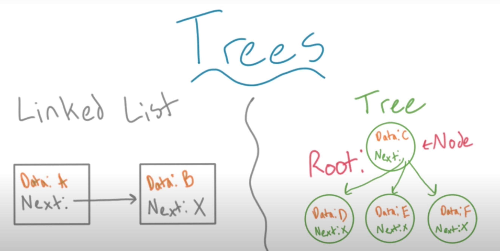

A tree organises values hierarchically.

## Characteristics and terminology of trees

(1) A tree must be `completely connected`, i.e. if you are starting from the root, you must be able to reach every node in the tree.

(2) There must be no cycles in trees. A cycle is when there is a loop in the tree, you encounter the same node twice.

(3) Nodes in a tree are described as having a parent child relationship. Children only have one parent. The nodes without any children are leaf nodes, or external nodes.

(4) Levels starts at 1, this is the root.

(5) Connections between nodes are edges. Edges taken together represent a path.

(6) The height of a node is the number of edges between it and the further edge on the tree. A leaf has a height of 0. The root will represent the height of the tree.

(7) The depth of a node is the number of edge to the root node. Height and depth are inverses of one another.

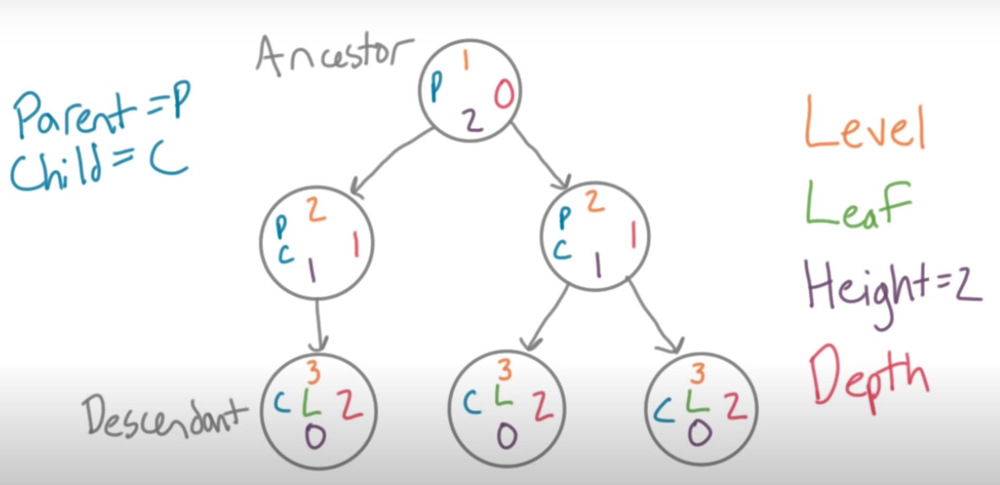 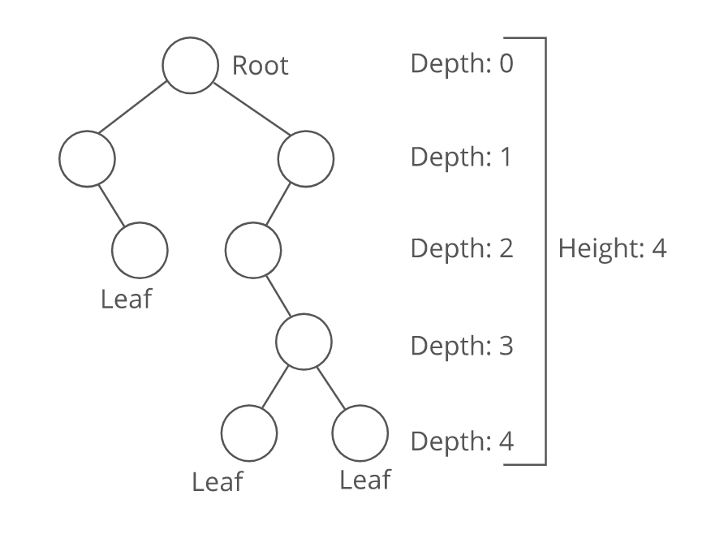

## Traversing trees

Unlike lists, trees are not linear structures, so there's no clear way to traverse every element. Should we do everything at the same level first, or do to the furtherest depth first and come back up?

Two main approaches;

### (1) DFS - depth first search

Explore the children node first.

There are several approaches this might take.

**Pre-order traversal** is one form of DFS, "check off a node and visit it's children as you see it before you traverse any further in the tree." Head left until you hit a leaf. Then you can go back up and explore further children of that parent node.

> Visit the current node, then walk the left subtree, and finally walk the right subtree.

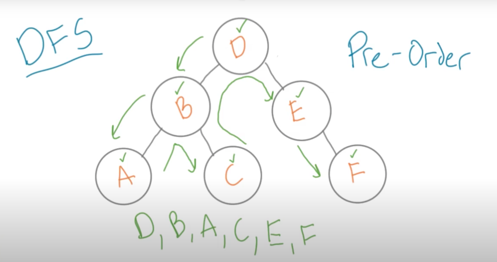

**In-order traversal** is another form of DFS. Though we explore nodes in the same order as a `pre-order traversal`, we do not **check off** a node until we have explored it's left most child and come back to it.

> Walk the left subtree first, then visit the current node, and finally walk the right subtree.

In this case we don't mark _B_ until we've seen _A_. It's "in-order" because we go from the left most to the right most in-order.

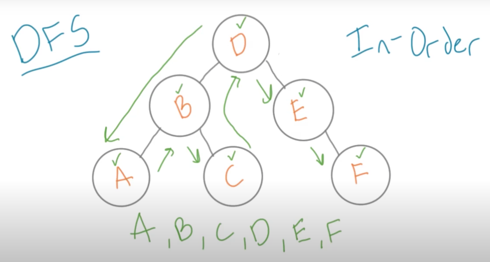

**Post-order traversal** - we don't check off a node until we've seen all of it's descendants.

> Walk the left subtree, then the right subtree, and finally visit the current node.

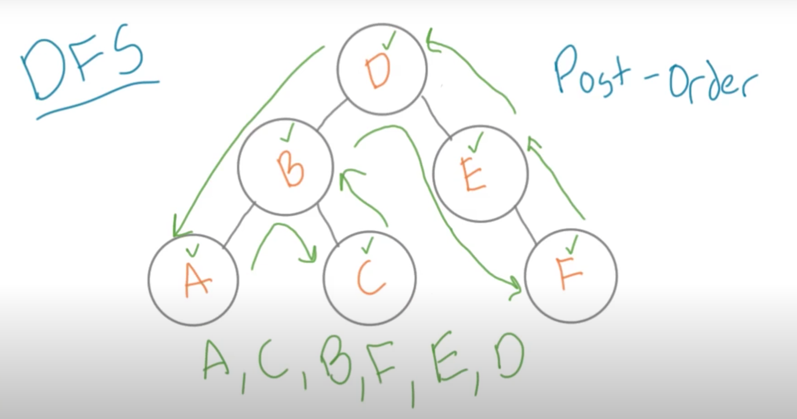

### (2) BFS - breadth first search

The priority is visiting every node on the same level, before visiting child nodes.

**Level order traversal** is a BFS with a more exact algorithm to implement.

By convention we start on the left, and move right.

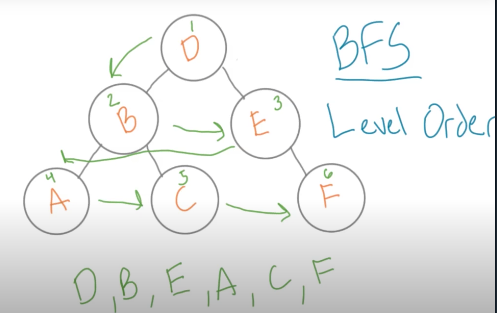

## Binary trees

Binary trees are those were nodes have at most two children.

Nodes have 0, 1, or 2 children.

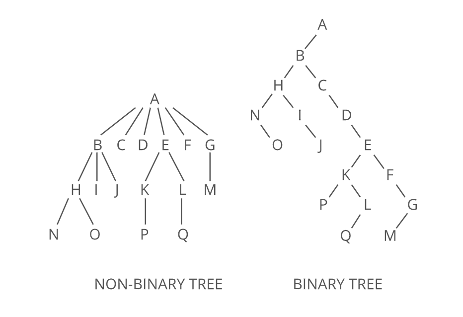

- A full binary tree is a binary tree where every node has exactly 0 or 2 children.

- A perfect binary tree doesn't have room for any more nodes—unless we increase the tree's height.

- A complete binary tree is like a perfect binary tree missing a few nodes in the last level. Nodes are filled in from left to right.

> Complete trees are the basis for heaps and priority queues.

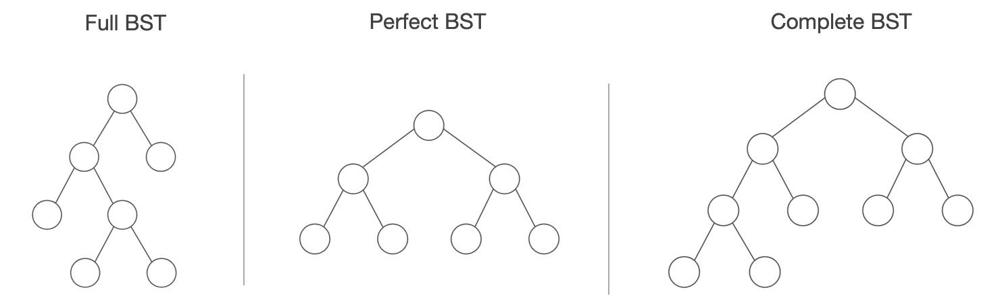

### Deleting a node

When we delete an element from a tree we need to make a decision of how we maintain the structure.

- Deleting a leaf is straight forward and requires no further consideration
- However if the node has a child we could delete delete the node and attach the child node to the deleted parent's node. Effectively promoting the node up a layer.
- If the node has multiple sub-children, we could promote of the nodes up the stack.
- If there is a long, complex tree, we could just shift any disconnected node in place of the deleted node. This requires some shuffling of elements.

### Inserting a node

When inserting to a binary tree, we just need to keep in mind the 2 child rule. We keep traversing down the tree until we find an empty spot where we can append the new node.

As the tree grows, each level can hold double the number of element than the previous level, because each node can have two children.

Level 1 = 1^2

Level 2 = 2^2

Level 3 = 4^2

This is $O(log(n))$

### Representing a Binary Tree as an array

The binary tree below;

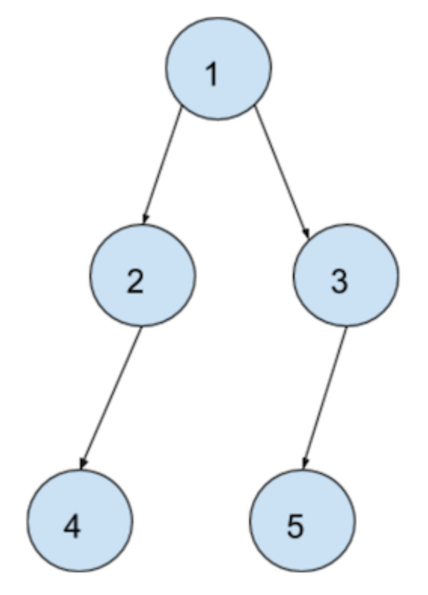

Would be represented in an array as: `[1, 2, 3, 4, None, 5, None, None, None, None, None]`

Starting with the root, then showing the nodes left and right child. Then showing the left and right child of `root.left`

For example `[root, root.left, root.right, root.left.left, root.left.right, root.right.left, root.right.right...]`

```Python
from queue import Queue
from typing import List

class BinaryTreeNode:

    def __init__(self, data):
        self.left = None
        self.right = None
        self.data = data

def convert_arr_to_binary_tree(arr: List) -> Node:
    """
    Takes arr representing level-order traversal of Binary Tree 
    """
    index = 0
    length = len(arr)
    
    if length <= 0 or arr[0] == -1:
        return None

    root = BinaryTreeNode(arr[index])
    index += 1
    queue = Queue()
    queue.put(root)
    
    while not queue.empty():
        current_node = queue.get()
        left_child = arr[index]
        index += 1
        
        if left_child is not None:
            left_node = BinaryTreeNode(left_child)
            current_node.left = left_node
            queue.put(left_node)
        
        right_child = arr[index]
        index += 1
        
        if right_child is not None:
            right_node = BinaryTreeNode(right_child)
            current_node.right = right_node
            queue.put(right_node)
    return root
```

### Calculating the diameter of a Binary Tree

The diameter of a Binary Tree is the maximum distance between any two nodes.

We need a recursive function to calculate the diameter of a Binary Tree

```Python
def diameter_of_binary_tree(root):
    return diameter_of_binary_tree_func(root)[1]
    
def diameter_of_binary_tree_func(root):
    """
    Diameter for a particular BinaryTree Node will be:
        1. Either diameter of left subtree
        2. Or diameter of a right subtree
        3. Sum of left-height and right-height
    :param root:
    :return: [height, diameter]
    """
    if root is None:
        return 0, 0

    left_height, left_diameter = diameter_of_binary_tree_func(root.left)
    right_height, right_diameter = diameter_of_binary_tree_func(root.right)

    current_height = max(left_height, right_height) + 1
    height_diameter = left_height + right_height
    current_diameter = max(left_diameter, right_diameter, height_diameter)

    return current_height, current_diameter
```

### Calculating the depth of a Binary Tree

Again, we need recursion;

```Python
def depth_of_tree(tree: Optional[Node]) -> int:
    """
    Recursive function that returns the depth of a binary tree.
    >>> root = Node(0)
    >>> depth_of_tree(root)
    1
    >>> root.left = Node(0)
    >>> depth_of_tree(root)
    2
    >>> root.right = Node(0)
    >>> depth_of_tree(root)
    2
    >>> root.left.right = Node(0)
    >>> depth_of_tree(root)
    3
    >>> depth_of_tree(root.left)
    2
    """
    return 1 + max(depth_of_tree(tree.left), depth_of_tree(tree.right)) if tree else 0
```

### Path from root to node

Given the root of a Binary Tree and a data value representing a node, return the path from the root to that node in the form of a list.

```Python
class BinaryTreeNode:

    def __init__(self, data):
        self.data = data
        self.left = None
        self.right = None

def path_from_root_to_node(root, data):
    """
    Assuming data as input to find the node
    The solution can be easily changed to find a node instead of data
    :param data:
    :return:
    """
    output = path_from_node_to_root(root, data)
    return list(reversed(output))

def path_from_node_to_root(root, data):
    if root is None:
        return None

    elif root.data == data:
        return [data]

    left_answer = path_from_node_to_root(root.left, data)
    if left_answer is not None:
        left_answer.append(root.data)
        return left_answer

    right_answer = path_from_node_to_root(root.right, data)
    if right_answer is not None:
        right_answer.append(root.data)
        return right_answer
    return None
```

## Specific types of trees

We can introduce rules into how elements in our tree are ordered to make certain tasks faster and more efficient.

### Binary search tree (BST)

Just as an array is a type of list, a Binary Search Tree is a type of Binary Tree.

Values in BSTs are sorted, from smallest to largest, left to right. Therefore, the value of all nodes to the left of any node will be smaller, and the value of all nodes to the right will be larger.

This makes operations like search and insert very fast. We only only have to look at one value in each value, and we know if we should move left or right. The run time is therefore equal to the height of a tree $O(log(n))$. Deletion is not guaranteed to be straight forward but is more likely to be so in a BST.

This is a legitimate BST, as all nodes have no more than 2 children, and every element to the left is smaller. Though it looks odd, it's known as an _unbalanced_ binary tree. Since the distribution of nodes is skewed. This is the worst case for a BST as operations will take linear time.

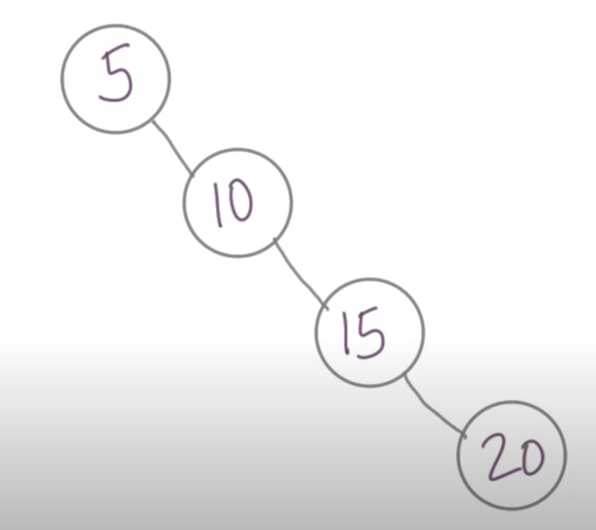

### Heap

Heaps come in two forms, a min-heap or a max-heap. In a min-heap the root node is the smallest element, as you go down the tree the elements get bigger. A max-heap is simply the reverse. In binary search tree, only the left node will be smaller than the value of its parent.

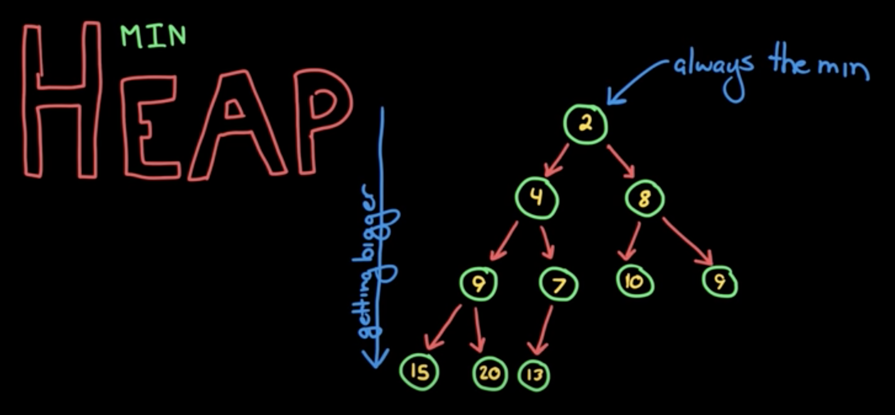

There are three rules that determine the relationship between the element at the index $k$ and its surrounding elements:

1. Its first child is at $2*k + 1$
2. Its second child is at $2*k + 2$
3. Its parent is at $(k - 1) // 2$

The heap property means that if `h` is a heap, then the following will never be False:
```python
h[k] <= h[2*k + 1] and h[k] <= h[2*k + 2]
```

Elements are inserted left to right at the first empty leaf node. We then “bubble up” the element to its correct position in the tree.

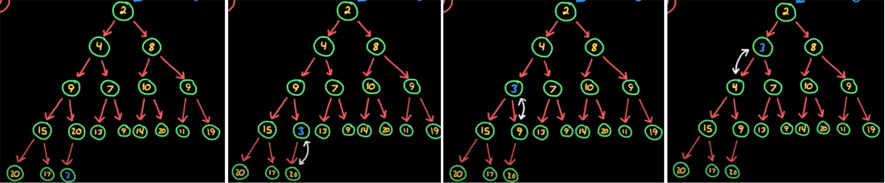

- Recursion - compare the inserted element with its parent, if it’s out of order, swap them
- Keep going up the tree until the parent is smaller than the inserted element

Removing the min element (root node). 
- Remove the min element and replace it if the last element added
- Take the new root element and “bubble it down” to the next appropriate spot. Compare the element with it’s two children and swap if with the smaller of the two.
- Keep going down the tree until the heap property is restored.

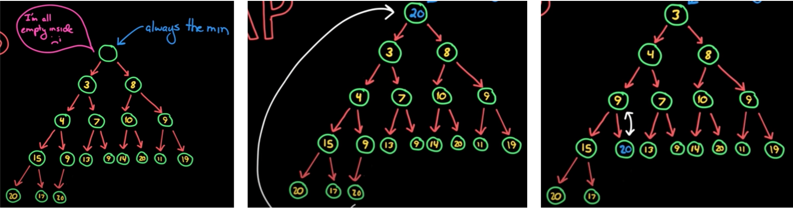

There are no gaps in the heap so we can use an array to implement the data structure.  This is regarded as a “complete binary tree”.
> In a complete binary tree, all levels except possibly the deepest one are full at all times. If the deepest level is incomplete, then it will have the nodes as far to the left as possible.

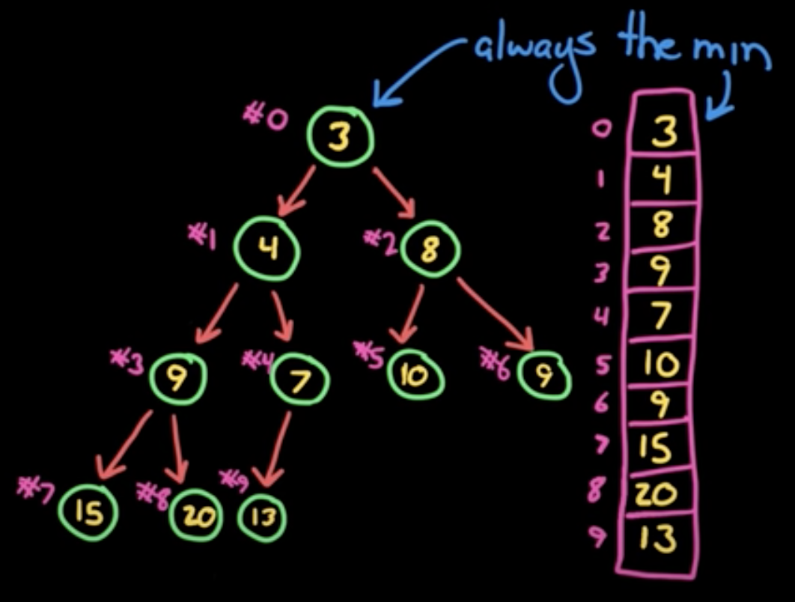

A visualisation from Lambda School [\[ref] ]()

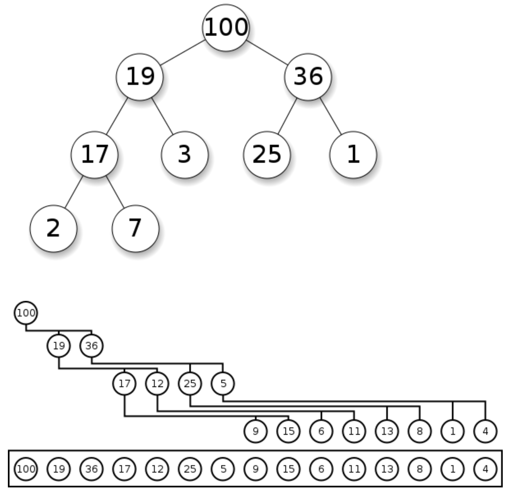

In Python, `heapq` provides a min-heap implementation. Python 3.9 implementation [here][2]

Heaps are commonly used to implement priority queues. In a min-heap the smallest element has the highest priority. In a max-heap the largest element has the highest priority.

Heaps are the `concrete data structure`-\> the implementation, whereas a priority queue would be regarded as the `abstract data structure` -\> the interface.
- Concrete data structures specify performance guarantees. Performance guarantees define the relationship between the size of the structure and the time operations take. 
- Abstract data structures specify operations and the relationships between them.

## Relationship between height and number of nodes

The number of nodes available on each level is $2^n$, where $n$ represents the level.

Level 0: $2^0 = 1$

Level 1: $2^1 = 2$

Level 2: $2^2 = 4$

Level 3: $2^3 = 8$

The level is equivalent to the height $h$ of a tree, so we can solve for the number of nodes $n$, using $h$;

$n = 2^h - 1$

$n + 1 = 2^h$

$\log\_2 ((n + 1)) = \log\_2 (2^h)$

$\log\_2 (n + 1) = h$

> A perfect tree is balanced, and in a perfect tree the height grows logarithmically with the number of nodes.

## Building tree data structures

Trees show up a lot in real life, particularly when storing data as they allow for fast retrieval. Machine Learning models will often take advantage of tree models, such as decision trees.

First we need a `Node` class

```python
class Node():
    def __init__(self, value=None):
        self.value: str = value  # using strings in this example
        self.left: Node = None
        self.right: Node = None

    def set_value(self, value: str):
        self.value = value

    def get_value(self) -> str:
        return self.value

    def set_left_child(self, value: str):
        self.left = Node(value)

    def set_right_child(self, value: str):
        self.right = Node(value)

    def get_left_child(self) -> Node:
        return self.left

    def get_right_child(self) -> Node:
        return self.right

    def has_left_child(self) -> bool:
        return self.left != None

    def has_right_child(self) -> bool:
        return self.right != None

    def __repr__(self):
        return f"Node({self.get_value()})"
```

We'll create a generic `binary tree` class.

```python
class Tree():
    def __init__(self, root: str=None):
        self.root = Node(root)

    def get_root(self):
        return self.root
```

## Traversing trees in practice

### Depth first search

Traversing a tree using depth first search.

Depth first search has 3 types: pre-order, in-order, and post-order.  

**First** create a tree that looks like this;

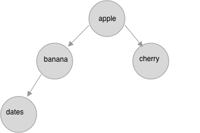

```python
fruit_tree = Tree("apple")
fruit_tree.get_root().set_left_child("banana")
fruit_tree.get_root().set_right_child("cherry")
fruit_tree.get_root().get_left_child().set_left_child("dates")
```

In _pre-order_ traversal, at each level; we visit the current node, and keep heading left, then we come back up and do the same on the right subtree.

In our case we would visit `apple` -\> `banana` -\> `dates` -\> `cherry`

> Notice how we're retracing our steps. It's like we are hiking on a trail, and trying to retrace our steps on the way back. This is an indication that we should use a stack.

We'll need a stack class.

```python
class Stack():
    def __init__(self):
        self.list = list()

    def push(self, value):
        self.list.append(value)

    def pop(self):
        return self.list.pop()

    def top(self):
        return self.list[-1] if len(self.list) > 0 else None

    def is_empty(self):
        return len(self.list) == 0

    def __repr__(self):  # print the values in list in reverse order
        if len(self.list) > 0:
            s = "<top of stack>\n_________________\n"
            s += "\n_________________\n".join([str(item) for item in self.list[::-1]])
            s += "\n_________________\n<bottom of stack>"
            return s

        else:
            return "<stack is empty>"

```

Traversing the tree in pre-order;

- Start at the root - add it to the stack
- Check to see if the root has a left child
  - If yes, go left and add that node to that stack (continue going left)
  - If no, check to see if the node has a right child
- If the node does not have a left or right child, it is a leaf, so we must retrace our steps
  - Pop the leaf node
- Go to the head of the stack (last value in it's list)
  - _remember we chose a stack as we want first in, first out_
  - check to see if it has a right child
	- if no, then pop that node from the stack
	- if yes, visit that node and start the process again (has left)
- We retrace our steps until the stack is empty

_See `traverse_tree_walkthrough_preorder.py` for a step-by-step guide._

In order to implement this logic using iteration, we'll want to introduce the concept of `state` where we track, whether we have visited a node's left and right children.

```python
class State():
    def __init__(self, node):
        self.node = node
        self.visited_left = False
        self.visited_right = False

    def get_node(self):
        return self.node

    def get_visited_left(self):
        return self.visited_left

    def get_visited_right(self):
        return self.visited_right

    def set_visited_left(self):
        self.visited_left = True

    def set_visited_right(self):
        self.visited_right = True

    def __repr__(self):
        s = f"""{self.node}
        visited_left = {self.visited_left}
        visited_right = {self.visited_right}
        """
        return s
```

This allows us to write a function to traverse the tree.

```python
def pre_order_traversal(tree: Tree) -> List[str]:
    visit_order = list()
    stack= Stack()
    node = tree.get_root()
    state = State(node)

    stack.push(state)  # adding the state class, rather than the node
    visit_order.append(node.get_value())

    while(node):
        if node.has_left_child() and not state.get_visited_left():
            state.set_visited_left()
            node = node.get_left_child()
            visit_order.append(node.get_value())
            state = State(node)
            stack.push(state)

        elif node.has_right_child() and not state.get_visited_right():
            state.set_visited_right()
            node = node.get_right_child()
            visit_order.append(node.get_value())
            state = State(node)
            # already in the stack as we check left first so no need to add

        else:
            # retrace steps, remove the last element in the stack
            # reset the state and node to element at the top of the stack
            stack.pop()
            if not stack.is_empty():
                state = stack.top()
                node = state.get_node()
            else:
                node = None

        return visit_order
```

We can use recursion to traverse the tree.

```python
def pre_order_traversal_with_recursion(tree: Tree) -> List[str]:
    """Return items in tree, following pre-order traversal"""
    visit_order = list()

    def recursive_logic(node):  # define the recursive logic, left first

        if node != None:  # base case, we don't need a return
            visit_order.append(node.value)
            recursive_logic(node.get_left_child())
            recursive_logic(node.get_right_child())

    recursive_logic(tree.get_root())

    return visit_order
```

### Breadth first search

Traversing the tree uses BFS logic;

- Start at the root
- Visit the left child
- Visit the right child
- Move to left child and do the same check

Now, rather than a `stack`, we'll want a `queue`.

We don't want to add the item we've just visited, rather we want to keep track of the order of items we've visited.

_See (`traverse_tree_walkthrough_bfs.py`)[][3] for a step-by-step guide._

```python
from collections import deque
q = deque()

class Queue():
    def __init__(self):
        self = q.deque()

    def enqueue(self, value):
        self.q.appendleft(value)

    def dequeue(self, value):
        self.pop() if len(self.q) > 0 else None

    def __len__(self):
        return len(self.q)

    def __repr__(self):
        if len(self.q) > 0:
            s = "<enqueue here>\n_________________\n"
            s += "\n_________________\n".join([str(item) for item in self.q])
            s += "\n_________________\n<dequeue here>"
            return s
        else:
            return "<queue is empty>"

def bfs(tree: Tree) -> List[str]:
    """Return items in tree, following pre-order traversal"""
    visit_order = list()
    q = Queue()
    node = tree.get_root()

    while(node):
        if node.has_left_child():
            q.enqueue(node.get_left_child())
        if node.has_right_child():
            q.enqueue(node.get_right_child())

        visit_order.append(node)
        node = q.dequeue()

    return visit_order
```

[2]:	https://github.com/python/cpython/blob/3.9/Lib/heapq.py
[3]:	%223.%20data_structures/tree/traverse_tree_walkthrough_bfs.py%22