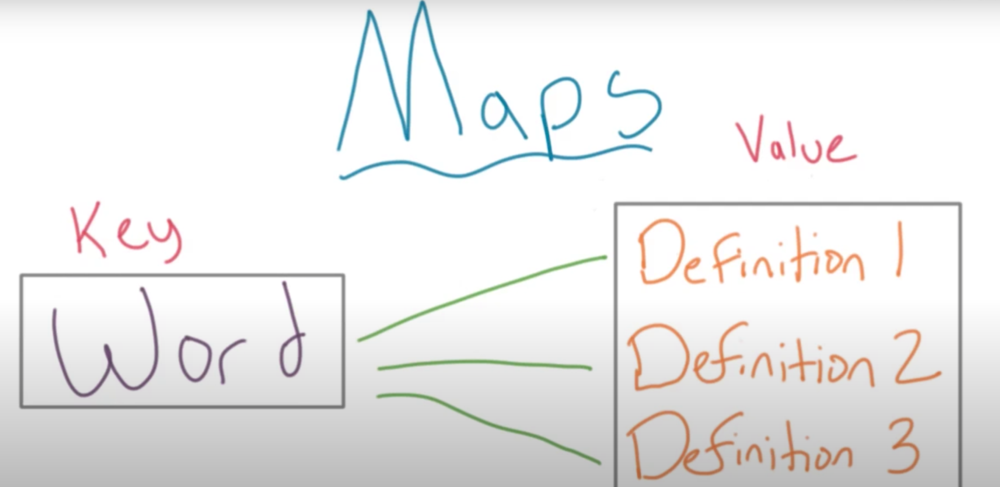
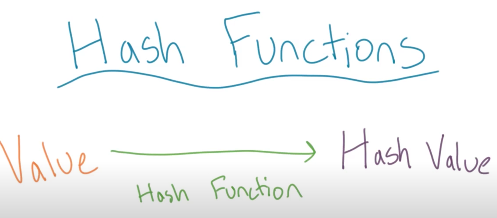
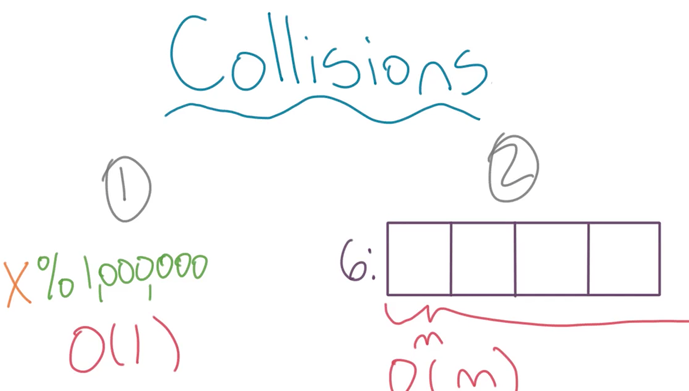
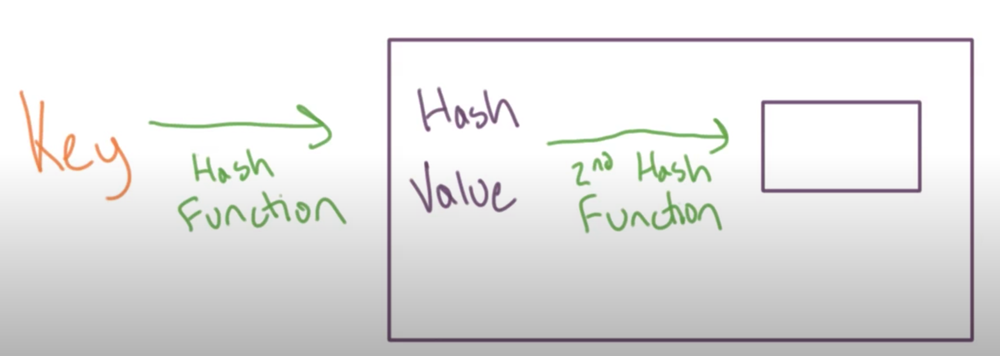
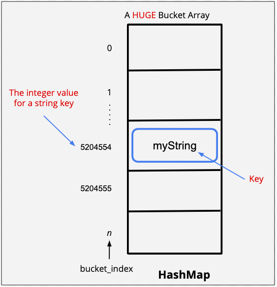
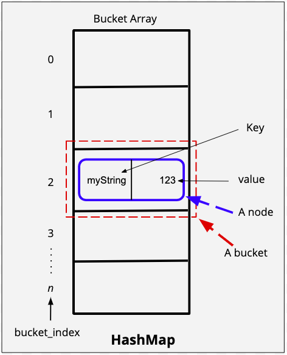
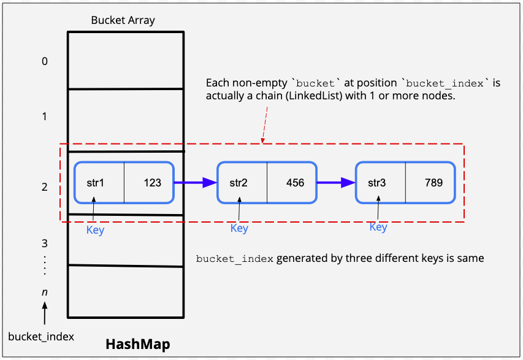
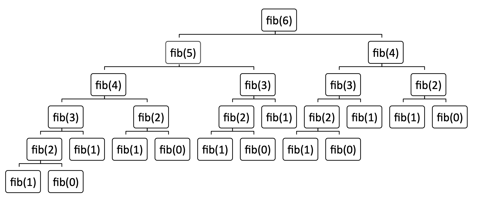

# Maps

The defining characteristic of a map is its key value structure. You can look up where something is by its key. Maps are called dictionaries for a similar reason. YOu look up a value based on its key.

## Sets

A set is comparable to a list. It's a collection of elements, however, elements in a set have no order and are unique.

Think of a set like a bag, you reach in a pull an element out, but you don't know the order in which you're doing so.

A map is a set based data structure. As an array is a list based data structure.

A collection of keys in a map are a set.

Keys in a map, like words in a dictionary, need to be unique. You can have many definitions for a word, but a word must appear once.

Keys are used to index values, they must be unique and immutable.



> Note: In Python 3.6 and beyond, dictionaries are ordered collections, meaning they keep their elements in the same order in which they were introduced.

**_Insert some note about Python object model being dictionaries_**

### Dictionaries in Python

```python
locations = {'North America': {'USA': ['Mountain View']}}
locations["Asia"] = {"India": ["Bangalore", "New Delhi"]}
locations["Asia"].update({"China": ["Shanghai"]})  # key must exist, even if value is none
locations["Africa"] = {"Egypt": ["Cairo"]}

# Print a list of all cities in the USA in alphabetic order.
print(sorted(locations["North America"]["USA"]))

# Print all cities in Asia, in alphabetic order, next to the name of the country
asian_cities = list()
for country, cities in locations["Asia"].items():
    for city in cities:
        asian_cities.append(f'{city} - {country}')

print(sorted(asian_cities))

# more pythonic
sorted([f"{city} - {country}" for country, cities in locations["Asia"].items() for city in cities])
```

When referencing a dictionary by key, if the key is not present you'll get a `KeyErrror` message. Using `dict.get(<key>)` will ignore the error and return `None` (or you can specify what to return).

```python
art_galleries.get('Louvre', 'Not Found')
# output: 'Not Found' because "Louvre" not in dictionary
```

## Hashing

> Hashing reduces the size of the search space - Raymond Hettinger

Using a data structure that employs a hash function allows you to do looks up in **constant time** not **linear time**.

In a list or a set you must look through every element. Stacks and queues let you look up the oldest or newest elements immediately. Priority queues will allow you to find the highest priority element, but any other element is a linear time search.

A hash function converts a value to one that can be stored and retrieved easily. The hash value acts as an index to the input value.



A common hash function is:

- take the last few digits of a big number
- divide it by some consistent number
- using the remainder to find a place to store that number in an array

```python
12345678

78 / 10 == 7, % == 8

# 123456 stored at index 8
```

This is why looking up an item using hash functions is constant time:

You give your number to a hash function, which returns a hash code, which provides the index of an array.

You know exactly where to go in the array given the value you're trying to find.

In most cases the last few digits of a big random are the "most" random.

## Collisions

When a hash function produces the same output for two different inputs is known as a collision.

You can overcome collisions by:

(1) changing the value (the divider) in your hash function, or change the hash function completely.

(2) change the structure of your array - create a list of values hashed at that one spot. This lists are generally called buckets. Rather than having one value in each slot, you can have a collection of values at each bucket.

The first one maintains constant time lookup $O(1)$, but by requiring a big number in your hash function you're going to require more space to store your values. Equally, doing this reactively, where you change the value of your hash function each time you have a collision then you have to move all your data to a new array. This increases the complexity terms of both size and time.

With the bucket approach you still need to iterate through a collection, though a shorter one. Though you could end up storing every value in one bucket which is equivalent to iterating through a list $O(n)$.

There is no one perfect way to design a hash function. Often you'll have to make the trade-off of choosing a hash function that either spreads out your data well but uses a lot of memory, versus one that uses fewer buckets (less memory) but may have to do some searching within each bucket.



If a bucket becomes larger you could use a hash function inside it.



## Hash maps

We use a hash function to determine where to store keys.

Maps have key, value pairs.

In a hash map, you use the keys as inputs to a hash function, then store the key, value pair in the bucket determined by the hash function. This is why keys must be immutable.

We could use a database, but often we want a data structure to store values as part of our program.

### Example of using hash maps

A simple example, we have the data of heights of each student. We want to store it so that next time someone asks for height of a student, we can easily return the value. But how can we store these heights?

#### Using Arrays

We can use one array to store the names of the students and use another array to store their corresponding heights at the corresponding indices.

What will be the time complexity in this scenario?

To obtain height of a student, say `Potter, Harry`, we will have to traverse the entire array and check if the value at a particular index matches `Potter, Harry`. Once we find the index in which this value is stored, we can use this index to obtain the height from the second array. 

Thus, because of this traveral, complexity for `get()` operation becomes $O(n)$. Even if we maintain a sorted array, the operation will not take less than $O(log(n))$ complexity.

What happens if a student leaves a class? We will have to delete the entry corresponding to the student from both the arrays.

This would require another traversal to find the index. And then we will have to shift our entire array to fill this gap. Again, the time complexity of operation becomes $O(n)$

#### Using Linked Lists

We can modify our `LinkedListNode` to have two different value attributes - one for name of the student and the other for height.

But we again face the same problem. In the worst case, we will have to traverse the entire linked list to find the height of a particular student. Once again, the cost of operation becomes $O(n)$.

#### Using Stacks and Queues

Stacks and Queues are LIFO and FIFO data structures respectively. Therefore they are not a good pick for `key, value` pairs.

### Hash functions in practice

Hash functions allow us to `map` data, i.e. store values in a location, and have a corresponding key to make looking up that data when called upon happen in constant time $O(n)$.

We want a hash function that reduces the number of collisions - where two different data sets return the same hash key.

A simple hash function where we just sum the ASCII values of a string would be pretty rubbish. We could get the same value for `abcd` and `bcda`.

```python
    def simple_hash_function(string):
        """sum of corresponding ASCII values"""
    hash_code = 0
    for character in string:
        hash_code += ord(character)
    return hash_code
```

We have different hash functions for different types of keys. The hash function for integers will be different from the hash function for strings, which again, will be different for some object of a class that you created.

For a string, say `abcde`, a very effective function is treating this as number of prime number base `p`.

For a number, say `578`, we can represent this number in base 10 number system as
$$5*10^2 + 7*10^1 + 8*10^0$$

Similarly, we can treat `abcde` in base `p` as 
$$a * p^4 + b * p^3 + c * p^2 + d * p^1 + e * p^0$$

Here, we replace each character with its corresponding ASCII value. 

The most common prime numbers used for this function are 31 and 37.

Using this algorithm, we can get a corresponding integer value for each string key and **use it as an index** of an array, say `bucket array`.

Each entry in this `bucket array` is called a `bucket` and the index in which we store a bucket is called `bucket index`. 



Strings can be used as keys. The hash function must convert the characters into numbers, typically done so using a letter's ASCII value. Typically, taking the first letter of the string.

In Java, a typically hash function is to $n$ number of characters and multiply it's ASCII value by a power:

```java
s[0] * 31 ^ (n-1)
+ s[1] * 31 ^ (n-2)
+ ... s[n-1]

// 31 used due to convention
```

This approach is likely to have few collisions, but even small strings will use a lot of memory.

Implementing our own hash function that uses strings.

- Store strings within buckets of the hash table
- The bucket (index) is calculated by the first two letters of the string.
- `Hash Value = (ASCII Value of First Letter * 100) + ASCII Value of Second Letter`

```python
"""Write a HashTable class that stores strings
in a hash table, where keys are calculated
using the first two letters of the string."""

class HashTable(object):
    def __init__(self):
        self.table = [None]*10000

    def store(self, string):
        """String stored in table at index"""
        self.table.insert(self.calculate_hash_value(string), string)

    def lookup(self, string):
        """Return the hash value if the
        string is already in the table.
        Return -1 otherwise."""
        if self.table[self.calculate_hash_value(string)] == None:
            return -1
        else:
            return self.calculate_hash_value(string)

    def calculate_hash_value(self, string):
        """ASCII values of upper case string: S[0] * 100 + S[1]"""
        return ord(string.upper()[0]) * 100 + ord(string.upper()[1])  
```

### Compression functions

A good hash function which will return unique values for unique objects. However, this comes at a cost, the values are extremely large. There is a trade-off between speed and memory.

A compression function, compresses the size of the array created

A very simple, good, and effective compression function can be ` mod len(array)`. The `modulo operator %` returns the remainder of one number when divided by other. 

So, if we have an array of size 10, we can be sure that modulo of any number with 10 will be less than 10. `9 % 10 == 9` or `12 % 10 == 2` using `x % 10` will always result in a value between 0-9.

This allows it to fit into our bucket array. You can visualize the `bucket array` again as shown in the figure below, in which the `bucket_index` is generated by the string key:



We can write the logic for compression function in our get_hash_code() function itself.

TODO review: https://www.khanacademy.org/computing/computer-science/cryptography/modarithmetic/a/modular-multiplication

### Handling collisions

Using a compression function makes us more prone to having collisions as we try to save space. **Remember, that a key will always be unique. But the bucket_index generated by two different keys can be the same.** 

There are two popular ways in which we handle collisions.

1. **Separate chaining** - Separate chaining is a technique where we use the same bucket to store multiple objects. The bucket in this case will store a linked list of key-value pairs. Every bucket has it's own separate chain of linked list nodes.

2. **Open Addressing** - In open addressing, we do the following:

- If, after getting the bucket index,  the bucket is empty, we store the object in that particular bucket

- If the bucket is not empty, we find an alternate bucket index by using another function which modifies the current hash code to give a new code. This process of finding an alternate bucket index is called **probing**. A few probing techniques are - linear probing, quadratic probing, or double hashing.

Good examples of these can be found below in the notes from `Raymond Hettinger's` talk "Modern Dictionaries in Python".

Visualising `separate chaining`


  
```python
class LinkedListNode:
    def __init__(self, key, value):
        self.key = key
        self.value = value
        self.next = None


class HashMap:
    def __init__(self, initial_size=10):
        self.bucket_array = [None for _ in range(initial_size)]
        self.p = 31
        self.num_entries = 0

    """
    Separate chaining:
    In case of collision, the `put()` function uses the same bucket to store a linked list of key-value pairs. 
    Every bucket will have it's own separate chain of linked list nodes.
    """

    def put(self, key, value):  # The key is a string, and value is numeric
        bucket_index = self.get_bucket_index(key)

        new_node = LinkedListNode(key, value)  # Create a node
        head = self.bucket_array[
            bucket_index
        ]  # Create a reference that points to the existing bucket at position bucket_index

        # Check if key is already present in the map, and UPDATE it's value
        # Remember, a key should always be unique.
        while head is not None:
            if head.key == key:
                head.value = value
                return
            head = head.next

        """
        If the key is a new one, hence not found in the chain (LinkedList), then following two cases arise:
         1. The key has generated a new bucket_index
         2. The key has generated an existing bucket_index. 
            This event is a Collision, i.e., two different keys have same bucket_index.

        In both the cases, we will prepend the new node (key, value) at the beginning (head) of the chain (LinkedList).
        Remember that each `bucket` at position `bucket_index` is actually a chain (LinkedList) with 1 or more nodes.  
        """
        head = self.bucket_array[bucket_index]
        new_node.next = head
        self.bucket_array[
            bucket_index
        ] = new_node  # Prepend the new node in the beginning of the linked list
        self.num_entries += 1

    def get(self, key):
        bucket_index = self.get_bucket_index(key)
        head = self.bucket_array[bucket_index]
        while head is not None:
            if head.key == key:
                return head.value
            head = head.next
        return None

    def get_bucket_index(self, key):
        bucket_index = self.get_hash_code(key)
        return bucket_index

    def get_hash_code(self, key):
        key = str(key)
        num_buckets = len(self.bucket_array)
        current_coefficient = 1
        hash_code = 0
        for character in key:
            hash_code += ord(character) * current_coefficient
            hash_code = hash_code % num_buckets  # compress hash_code
            current_coefficient *= self.p
            current_coefficient = (
                current_coefficient % num_buckets
            )  # compress coefficient

        return hash_code % num_buckets  # one last compression before returning

    def size(self):
        return self.num_entries

    # Helper function to see the hashmap
    def __repr__(self):
        output = "\nLet's view the hash map:"

        node = self.bucket_array
        for bucket_index, node in enumerate(self.bucket_array):
            if node is None:
                output += "\n[{}] ".format(bucket_index)
            else:
                output += "\n[{}]".format(bucket_index)
                while node is not None:
                    output += " ({} , {}) ".format(node.key, node.value)
                    if node.next is not None:
                        output += " --> "
                    node = node.next

        return output
```

### Time Complexity and Rehashing

#### Put Operation

- In the put operation, we first figure out the bucket index. Calculating the hash code to figure out the bucket index takes some time.

- After that, we go to the bucket index and in the worst case we traverse the linked list to find out if the key is already present or not. This also takes some time.

To analyze the time complexity for any algorithm as a function of the input size `n`, we first have to determine what our input is. In this case, we are putting and getting key-value pairs. So, these entries i.e. key-value pairs are our input. Therefore, our `n` is number of such key-value pair entries.

*Note: time complexity is always determined in terms of input size and not the actual amount of work that is being done independent of input size. That "independent amount of work" will be constant for every input size so we disregard that.*

- In case of our hash function, the computation time for hash code depends on the size of each string. Compared to number of entries (which we always consider to be very high e.g. in the order of $10^5$) the length of each string can be considered to be very small. Also, most of the strings will be around the same size when compared to this high number of entries. Hence, we can ignore the hash computation time in our analysis of time complexity.

- Now, the entire time complexity essentialy depends on the linked list traversal. In the worst case, all entries would go to the same bucket index and our linked list at that index would be huge. Therefore, the time complexity in that scenario would be $O(n)$. However, hash functions are wisely chosen so that this does not happen. 

`On average, the distribution of entries is such that if we have n entries and b buckets, then each bucket does not have more than n/b key-value pair entries.` 

Therefore, because of our choice of hash functions, we can assume that the time complexity is $O(\dfrac{n}{b})$.
This number which determines the `load` on our bucket array `n/b` is known as load factor. 

Generally, we try to keep our load factor around or less than 0.7. This essentially means that if we have a bucket array of size 10, then the number of key-value pair entries will not be more than 7.

**What happens when we get more entries and the value of our load factor crosses 0.7?**

In that scenario, we must increase the size of our bucket array. Also, we must recalculate the bucket index for each entry in the hash map.

*Note: the hash code for each key present in the bucket array would still be the same. However, because of the compression function, the bucket index will change.* 

Therefore, we need to `rehash` all the entries in our hash map. This is known as `Rehashing`.

#### Get and Delete operation

The solution follows the same logic for `get` and `delete`.

We assume a constant time of operation for generating the hash code (bucket-index) for a given key. Ignore this constant time.

Similarly, we can refer to the head of linked list at generated bucket-index in *O(1)* time. 

Next, we might have to traverse the the linked list in the worst-case scenario, making the time complexity as $O(\dfrac{n}{b})$.

Note that we do not reduce the size of bucket array in delete operation.

**Note:** Theoretically, the worst case time complexity of `put` and `get` operations of a HashMap can be $O(\dfrac{n}{b}) \approx O(n)$, when $b < < n$ . However, our hashing functions are sophisticated enough that in real-life we easily avoid collisions and never hit `O(n)`. Rather, for the most part, we can safely assume that the time complexity of `put` and `get` operations will be `O(1)`. 

Therefore, when you are asked to solve any practice problem involving HashMaps, assume the worst case time complexity for `put` and `get` operations to be `O(1)`.

## Caching

Caching can be defined as the process of storing data into a temporary data storage to avoid re-computation or to avoid reading the data from a relatively slower part of memory again and again. Thus caching serves as a fast "look-up" storage allowing programs to execute faster.

Recursive solutions, such as Fibonacci, or the Staircase problem are good examples of benefiting from caching.

```python
"""
A child is running up a staircase and can hop either 1 step, 2 steps or 3 steps at a time.

Given that the staircase has a total n steps, write a function to count the number of possible ways in which child can run up the stairs.
"""

def staircase(n):
    """permutations for climbing a staircase"""
    if n == 1:
        return 1
    elif n == 2:
        return 2
    elif n == 3:
        return 4
    return staircase(n - 1) + staircase(n - 2) + staircase(n - 3)

def fib(n):
    """assumes x an int >= 0
       returns Fibonacci of x"""
    if n == 0 or n == 1:
        return 1
    else:
        return fib(x-1) + fib(x-2)

```

Both of these, get slow very quickly.

To compute fibonacci of 6, we have to compute fib(3), three times;



There's a similar problem in the `staircase` function.

To compute the number of permutation for 5 steps, we have to do:
- `(n=4), (n=3), and (n=2)`
- To calculate the answer for `n=4`, we would have to do `(n=3), (n=2) and (n=1)`

However, we can perform a calculation once and store the result to speed up our program.

Though we're talking about hashing, this technique is known as "memoisation" as is at the heart of *dynamic programming*

> Dynamic programming was invested by Richard Bellman, though he chose the word "dynamic" because it didn't mean anything.
>
> "The 1950s were not good years for mathematical research... I felt I had to do something to shield Wilson and the Air Force from the fact that I was really going mathematics... What title, what name, could I choose? It's impossible to use the word dynamic in a pejorative sense. Try thinking of some combination that will possibly give it a pejorative meaning. It's impossible. Thus, I thought dynamic programming was a good name. It was something not even a Congressman could object to. So I used it as an umbrella for my activities."
> 

Memoisation works when a problem has optimal substructure and overlapping sub-problems.

Rewriting our functions and storing the values in a dictionary (hash table).

We first check if the calculation exists in our table, if yes, use that, if not, compute and add.

```python
def staircase(n):
    """permutations for climbing a staircase"""
    lookup = {1: 1,
             2: 2,
             3: 4}

    if n in lookup:
        return lookup[n]
    else:
        lookup[n] = staircase(n - 1) + staircase(n - 2) + staircase(n - 3)
        return lookup[n]


def fib(n):
    """assumes x an int >= 0
       returns Fibonacci of x"""
    d = {1:1, 2:2}
    if n in d:
        return d[n]
    else:
        d[n] = fib(n-1) + fib(n-2)
        return d[n]

```

If the entry is found in the cache, it is known as a `cache hit`. If the entry is not found, it is known as a `cache miss`

When designing a cache, we place an upper bound on the size of the cache. If the cache is full and we want to add a new entry to the cache, we use some criteria to remove an element.

A __LRU (least recently used) cache__ will remove the least recently used entry when the cache memory reaches its limit.

## Bonus: Raymond Hettinger on Modern Dictionaries in Python

Excellent talk, available [here](https://www.youtube.com/watch?v=p33CVV29OG8&ab_channel=SFPython)

The entire language of Python is wrapped around dictionaries. Everytime you're using a dot in Python you're doing a dictionary lookup. You're not actually storing items in a list, that list points to a Python object, which is in itself a dictionary.

****

`vars` is an unloved function.

`vars() function returns the __dict__ attribute of the given object.`

```python
class Foo:
  def __init__(self, a = 5, b = 10):
    self.a = a
    self.b = b
  
object = Foo()
print(vars(object))

# {'a': 5, 'b': 10}
```

****

Dictionary size

| Version | Dict Size | Dict Ordering |
|---|---|---|---|
| Py 2.7 | 280 | Scrambled but deterministic   |
| Py 3.5 | 196 | Randomised each time |
| Py 3.6 | 112 | Ordered  |

Mark Shannon introduced "key sharing" dictionaries in 3.5. The key and the hash is stored once if it is repeated across different dictionaries.

```python
keys = 'guido sarah barry rachel time'.split()
values1 = 'blue orange green yellow red'.split()
values2 = 'austin dallas tuscon reno portland'.split()
values3 = 'apple banana orange pear peach'.split()
hashes = list(map(abs, map(hash, keys)))
entries = list(zip(hashes, keys, values1))
comb_entries = list(zip(hashes, keys, values1, values2, values3))
```

How would a dictionary do it?

It would store the value in columns with a primary key. This was because memory was precious.

```python
from pprint import pprint

def database_linear_search():
    pprint(list(zip(keys, values1, values2, values3)))

# output
[('guido', 'blue', 'austin', 'apple'),
 ('sarah', 'orange', 'dallas', 'banana'),
 ('barry', 'green', 'tuscon', 'orange'),
 ('rachel', 'yellow', 'reno', 'pear'),
 ('time', 'red', 'portland', 'peach')]
```

How would Lisp do it?

Lisp would stores these as association list, associated a key with a value.

```python
def association_lists():
    pprint([
        list(zip(keys, values1)),
        list(zip(keys, values2)),
        list(zip(keys, values3))
    ])

# output
[[('guido', 'blue'),
  ('sarah', 'orange'),
  ('barry', 'green'),
  ('rachel', 'yellow'),
  ('time', 'red')],

 [('guido', 'austin'),
  ('sarah', 'dallas'),
  ('barry', 'tuscon'),
  ('rachel', 'reno'),
  ('time', 'portland')],

 [('guido', 'apple'),
  ('sarah', 'banana'),
  ('barry', 'orange'),
  ('rachel', 'pear'),
  ('time', 'peach')]]
```

However, we can speed this up by a constant factor by placing key value pairs in buckets using a hash value.

```python
def separate_chaining(n):
    buckets = [[] for i in range(n)]
    for pair in entries:
        h, key, value = pair
        i = h % n
        buckets[i].append(pair)
    return buckets
```

Two buckets
```python
pprint(separate_chaining(2))

# output
[[(8938476360186671130, 'guido', 'blue'),
  (4192199038866281708, 'sarah', 'orange'),
  (8619245411687931298, 'rachel', 'yellow'),
  (8444942453667155124, 'time', 'red')],
 [(7255237981569190873, 'barry', 'green')]]
```

More buckets increases the likelihood each gets their own bucket, so we find everyone one in constant time. However, it does not guarantee it to be the case
```python
pprint(separate_chaining(8))

# output
[[],
 [(7255237981569190873, 'barry', 'green')],
 [(8938476360186671130, 'guido', 'blue'),
  (8619245411687931298, 'rachel', 'yellow')],
 [],
 [(4192199038866281708, 'sarah', 'orange'),
  (8444942453667155124, 'time', 'red')],
 [],
 [],
 []]
```

This improves the speed at which we can look items up but we throw more memory away. Not just in terms of more buckets, but each list of values needs extra memory in order to allow it to grow.

In **open addressing** we don't allocate the extra memory at the end of each list. We make one big table to begin with and insert everything into it.

```python
def open_addressing_linear(n):
    table = [None] * n
    for h, key, value in entries:
        i = h % n  # index is modulo of the table size
        while table[i] is not None:  # is table is already occupied find another slot
            i = (i + 1) % n
        table[i] = (key, value)
    return table

pprint(open_addressing_linear(8))

# output
[None,
 ('barry', 'green'),
 ('guido', 'blue'),
 ('rachel', 'yellow'),
 ('sarah', 'orange'),
 ('time', 'red'),
 None,
 None]
```

If there is a collision, i.e. an entry wants to go in the same space that is already occupied, we do a "linear probe" and wrap around to get a new index (which is the next available slot).

This can result in a "catastrophic linear pile-up" where every element wants the same address.

**Open addressing with multiple hashing** says rather than do a linear probe, do another hash to find an available space. It doesn't speed up the best case but prevents the worst case from being catastrophic.

A good random number generator is `i = 5 * i + 1`

```python
def open_addressing_multihash(n):
    table = [None] * n
    for h, key, value in entries:
        perturb = h
        i = h % n
        while table[i] is not None:
            print(f"{key} collided with {table[i][0]}")
            i = (5 * i + perturb + 1) % n  # this operation guarantees to find a hole in your table, it won't get caught in a loop
            perturb >>= 5  # bitwise operation
        table[i] = (key, value)
    return table

# output
rachel collided with guido
time collided with sarah
time collided with barry
[None,
 ('barry', 'green'),
 ('guido', 'blue'),
 ('time', 'red'),
 ('sarah', 'orange'),
 ('rachel', 'yellow'),
 None,
 None]
```

However, this has slowed it down as there are now more collisions. We saved some space and improved the worst case.

This structure is "wide". Therefore having holes is a problem, because each hole gets multiplied by its width, so the wastage adds up.

**Compact dictionaries** pulls out the hash table as an array of bytes. The entries table will contain no empty space. The holes are put into a tiny table for just the keys.

```python
def compact_and_ordered(n):
    table = [None] * n
    for pos, entry in enumerate(entries):
        h = perturb = entry[0]
        i = h % n
        while table[i] is not None:
            i = (5 * i + perturb + 1) % n  # this operation guarantees to find a hole in your table, it won't get caught in a loop
            perturb >>= 5  # bitwise operation
        table[i] = pos
    return table, entries

table, entries = compact_and_ordered(8)
pprint(entries)
pprint(table)

# output
[(8938476360186671130, 'guido', 'blue'),
 (4192199038866281708, 'sarah', 'orange'),
 (7255237981569190873, 'barry', 'green'),
 (8619245411687931298, 'rachel', 'yellow'),
 (8444942453667155124, 'time', 'red')]

# lookup table with pointers
[None, 2, 0, 4, 1, 3, None, None]
```

We combine these ideas to get a shared and compact dictioanry.

```python
def shared_and_compact(n):
    """Compact, ordered and shared"""
    table = [None] * n
    for pos, entry in enumerate(comb_entries):
        h = perturb = entry[0]
        i = h % n
        while table[i] is not None:
            i = (5 * i + perturb + 1) % n
            perturb >>= 5
        table[i] = pos
    return table, comb_entries
```

We have everything in one table now.

```python
table, entries = shared_and_compact(8)
pprint(entries)
pprint(table)

# output
[(8938476360186671130, 'guido', 'blue', 'austin', 'apple'),
 (4192199038866281708, 'sarah', 'orange', 'dallas', 'banana'),
 (7255237981569190873, 'barry', 'green', 'tuscon', 'orange'),
 (8619245411687931298, 'rachel', 'yellow', 'reno', 'pear'),
 (8444942453667155124, 'time', 'red', 'portland', 'peach')]

[None, 2, 0, 4, 1, 3, None, None]
```

Now we can make the table more sparse to decrease collisions to speed up the program, without eating up memory. There is no change in the size of the table of hashes and values. Doubling the size of the table costs just 8 bytes in this example.

```python
table, entries = shared_and_compact(16)
pprint(entries)
pprint(table)

# output
[(8938476360186671130, 'guido', 'blue', 'austin', 'apple'),
 (4192199038866281708, 'sarah', 'orange', 'dallas', 'banana'),
 (7255237981569190873, 'barry', 'green', 'tuscon', 'orange'),
 (8619245411687931298, 'rachel', 'yellow', 'reno', 'pear'),
 (8444942453667155124, 'time', 'red', 'portland', 'peach')]

[None, 2, 0, 4, None, 3, None, None,
None, None, None, None, 1, None, None, None]
```

This is re-inventing the database shape, though augmented by a hash and an index table. As Moore's law took shape, we wasted space, until our data started to become the limiting factor and we had to re-learn the lessons of the past.

The lessons of databases are now being applied to the object orientated world.
