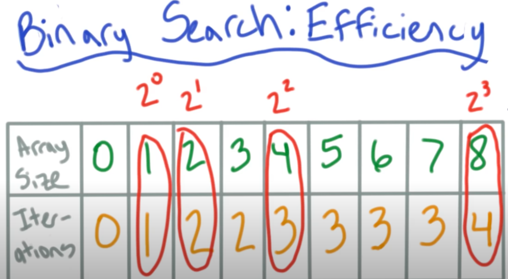
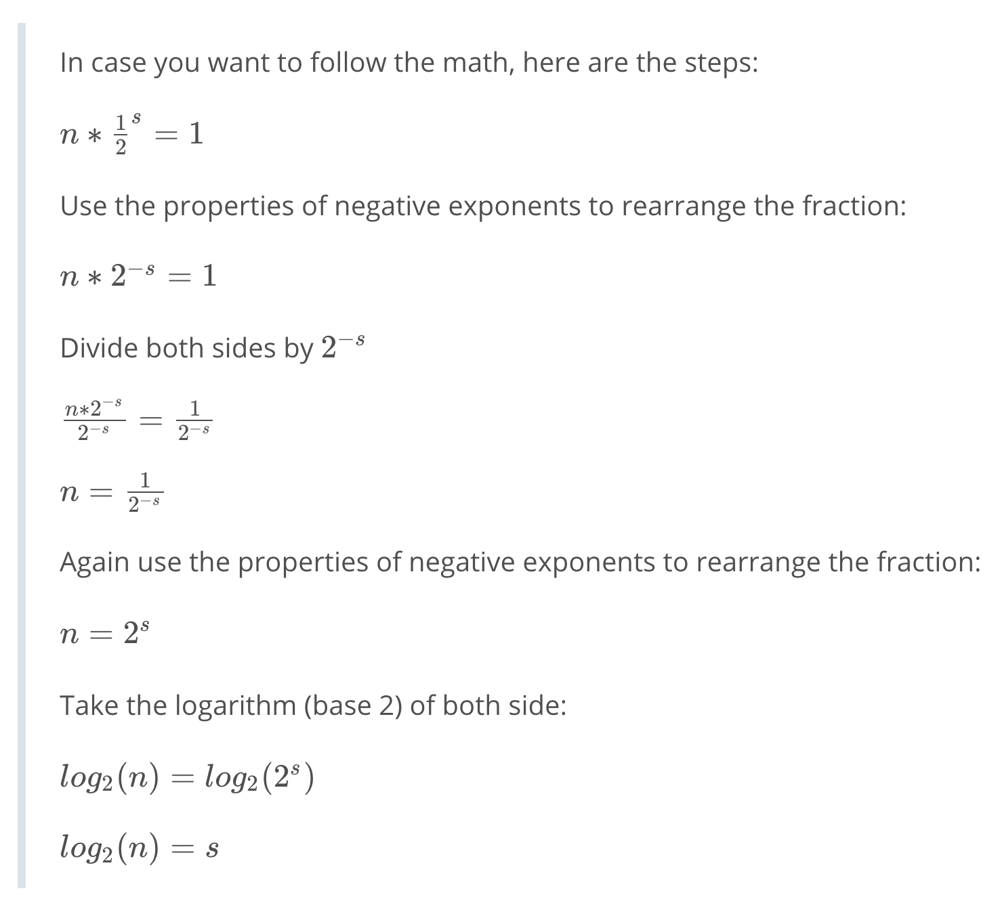
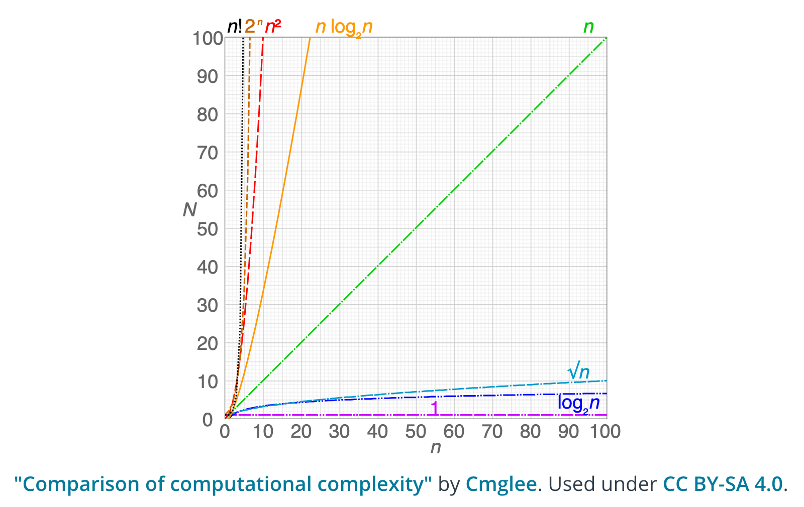

# Basic Algorithms

Peter Bernstein defined algorithms are "rules for computing".

> An algorithm is a finite liss of instructions that describe a computation that when executed on a set of inputs will proceed through a set of well-defined states and eventually produce an output.

An algorithm[^1] is just a finite set of steps used to solve a problem. Algorithms are not confined to computation or mathematics.

> When you cook bread from a recipe, you're following an algorithm. When you knot a sweater from a pattern, you're following an algorithm, When you put a sharp edge on a piece of flint by executing a precise sequence of strike with the end of an antler (a key step in making fine stone tools), you're following an algorithm -- Algorithms to live by

[^1]: The word "algorithm" is derived from the name of the Persian mathematician Muhammad ibn Musa al-Khwarizmi. His book also provides the source of the word "algebra".

## Linear Search

Suppose that you have a dictionary of words and that you need to look up a particular word in this dictionary. However, this dictionary is a pretty terrible dictionary, because the words are all in a scrambled order (and not alphabetical as they usually are). What search strategy would you use to find the definition you're looking for?

Because the words are in a random order, the best we can do is simply to go one by one, from the first page to the last page, in a sequential manner. Sounds tedious, right? This is called **linear search**. Time complexity of linear search is $O(n)$, directly proportional to the input.

## Binary Search

Binary search, start at the middle and then go right or left. Do this recursively. The legend that is David Malan explains this by looking up a name in a phone book;

[](https://www.youtube.com/watch?v=YzT8zDPihmc)

As an algorithm we following the steps;

- We find the position of a target value by comparing the middle value with this target value.
- If the middle value is equal to the target value, then we have our solution (we have found the position of our target value).
- If the target value comes before the middle value, we look for the target value in the left half.
- Otherwise, we look for the target value in the right half.
- We repeat this process as many times as needed, until we find the target value.

The word binary means "having two parts". Binary search means we are doing a search where, at each step, we divide the input into two parts.

_Note that the data we are searching through has to be sorted._

The total number of integers in the array is $n$. After each step, we reduce the number of elements remaining that we need to search.

| Number of steps | Number of elements left to search |
|-|-|
| 0 | $n$ |
| 1 | $\frac{n}{2}$ |
| 2 | $\frac{n}{4}$ |
| 3 | $\frac{n}{8}$ |
| 4 | $\frac{n}{16}$ |

_Notice, this is the same as repeatedly multiplying by $\frac{1}{2}$_

**Time complexity is driven by the number of steps we have to take in the worst-case scenario.**, how many times we need to run the algorithm. The maximum number of iterations required for an array size of 0 to 8;



_Note, making a results table like this is a great way to try and calculate the time complexity of an algorithm, you can normally intuit a relation and notice patterns._

Worst case scenario is three because we need to get down to 1;

- Step 1: 8 * 1/2 = 4
- Step 2: 4 * 1/2 = 2
- Step 3: 2 * 1/2 = 1
- Or, 8 * $\frac{1}{2}^3$ = 1

This is generalisable: $n * \frac{1}{2}^s = 1$, where $n$ is the array size and $s$ the number of steps.

Each time the array doubles in size, it takes another iteration of the algorithm to complete.

There is a relationship between the exponent of 2 and number of iterations. O(power of 2 exponent + 1). Logarithms let us express the function $2^3 = 8$ in a different way; $\log_2 8 = 3$, so O(log_2 (n) + 1).

This can be tidied up.

- Adding a constant of 1 does not have a meaningful impact on the efficiency
- In computer science, we assume that logarithms are in base 2 (typically we would assume base 10)
- $O(log(n))$

We can also calculate the efficiency using a proof. Finding $s$ in our equation above;



This is pretty great;



### Binary search in Python

We'll solve the problem two different ways—both iteratively and recursively.

```Python
import math
from typing import List

def binary_search(array: List, target: int) -> int:
    '''binary search algorithm using iteration
   
    args:
      array: a sorted array of items of the same type
      target: the element you're searching for
   
    returns:
      int: the index of the target, if found, in the source
      -1: if the target is not found
    '''
    attempt = start_index = 0
    end_index = len(array)-1
    max_attempts = round(math.log(len(array), 2))

    while attempt <= max_attempts:  # alternative, while start_index <= end_index
        attempt += 1
        idx = (start_index + end_index)//2

        if array[idx] == target:
            return idx
        
        elif array[idx] < target:
            start_index = idx  # search second half of the list, set mid as lower limit
        
        elif array[idx] > target:
            end_index = idx  # search first half of the list, set mid as upper limit

    return -1

def binary_search_recursive(array, target):
    '''binary search algorithm using recursion
    
    args:
      array: a sorted array of items of the same type
      target: the element you're searching for
         
    returns:
      int: the index of the target, if found, in the source
      -1: if the target is not found
    '''
    return binary_search_recursive_soln(array, target, 0, len(array) - 1)

def binary_search_recursive_soln(array, target, start_index, end_index):
    idx = (start_index + end_index)//2

    if array[idx] == target:
        return idx

    elif start_index > end_index or start_index == end_index == 0:
        return - 1

    elif array[idx] < target:
        binary_search_recursive_soln(array, target, idx, end_index)

    elif array[idx] > target:
        binary_search_recursive_soln(array, target, start_index, idx)

```
