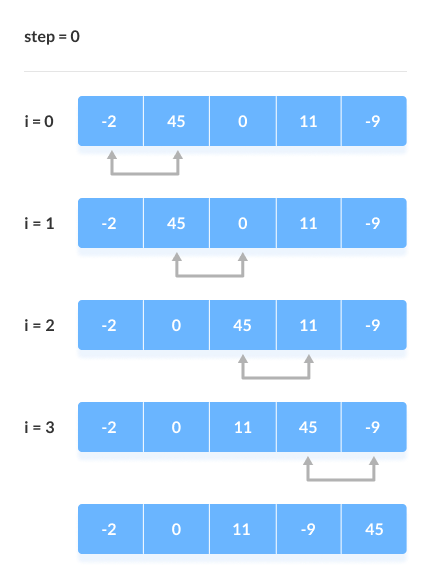
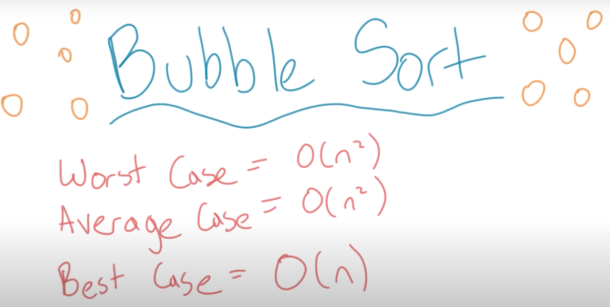
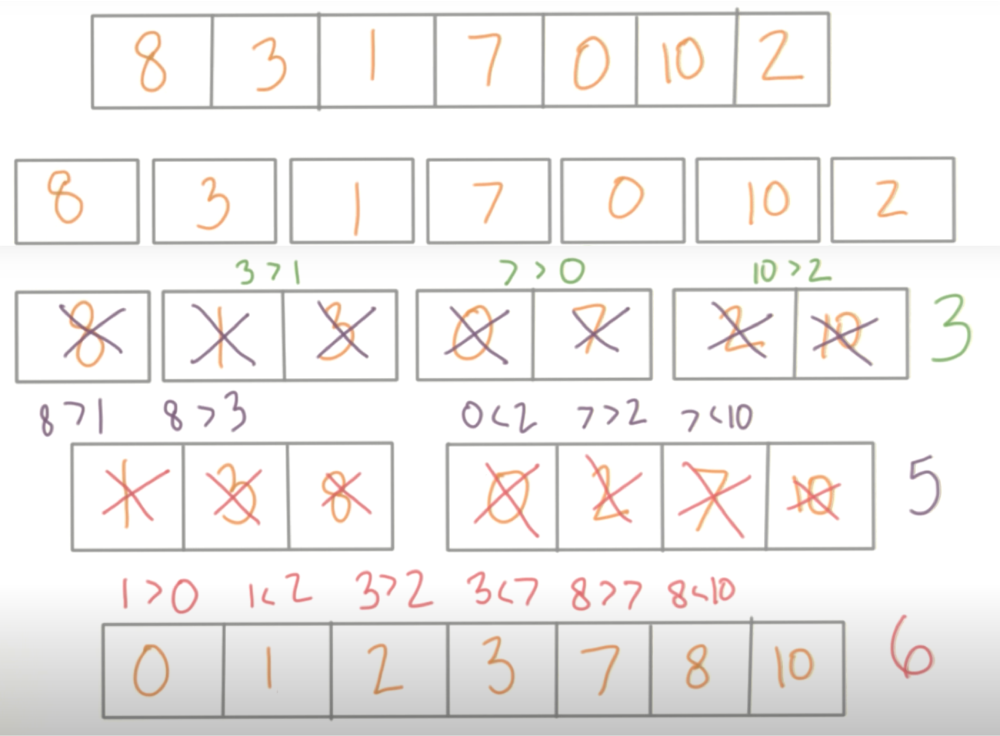
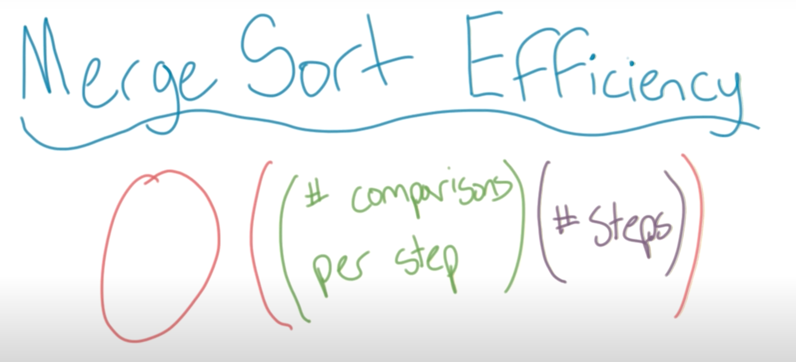
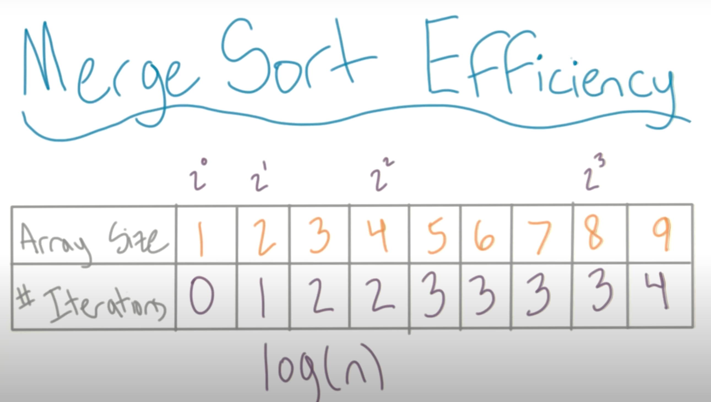
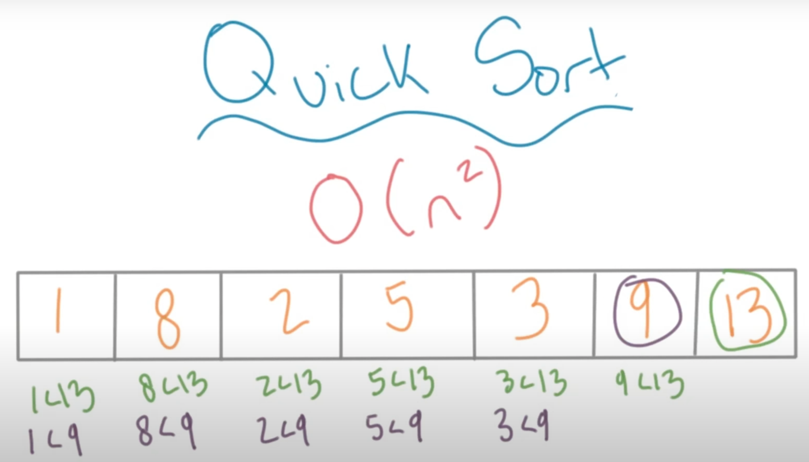
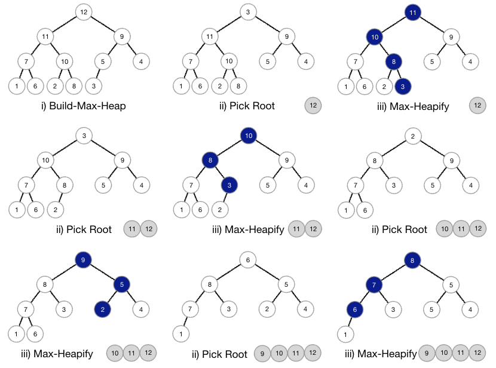

# Sorting algorithms

The naive approach is to compare every element to every other element to determine if elements are in order.

Sorting algorithms can be performed "inplace", sorted within the data structure without being copied. This will use less space as the elements won't be copied, however, it is likely to be more complex in terms of computation and therefore use more time. Once again, as with search algorithms, we have the classic trade=off of space versus time.

## Bubble sort

This is the naive approach, you take an element and compare it to every element in the array, you repeat for all elements in the array.You sort at "the bottom and work your way up".

It's called "bubble sort" because in each iteration the largest element will "bubble to the top".



Each iteration requires us to make $n - 1$ comparisons, and we are required to do $n - 1$ iterations each time.

Big O:

$$(n - 1) (n - 1) = n^2 - 2n + 1$$

Big O is not exact, so we don't worry about the constants, only the exponents, as a result, we express Big O of bubble sort as: $O(n^2)$

The most common implementation of bubble sort will assume that after the first iteration the last two elements don't need to be compared, after the second iteration the last three elements don't need to be compared and so on. This saves a little time but doesn't change our overall runtime of $O(n^2)$.



Bubble sort is performed inplace, so space complexity is $O(1)$.

```Python
from typing import List, Tuple

def bubble_sort(arr: List[int]) -> List[int]:
    """sort array from smallest to largest"""
    n = len(arr)
    for iteration in range(n):
        swapped = False
        for idx in range(1, n):
            if arr[idx - 1] <= arr[idx]:
                continue
            else:  # swap
                swapped = True
                arr[idx - 1], arr[idx] = arr[idx], arr[idx - 1]
        if not swapped:
            break  # stop iteration as arr sorted
    return arr
    

def bubble_sort2(arr: List[Tuple[int, int]]) -> List[Tuple[int, int]]:
    """sort tuples from largest to smallest"""
    n = len(arr)
    for iteration in range(n):
        for idx in range(0, n - 1):
            element = arr[idx]
            nxt = arr[idx + 1]

            if nxt[0] < element[0] or (nxt[0] == element[0] and nxt[1] <= element[1]):
                continue

            else:  # swap
                arr[idx] = nxt
                arr[idx + 1] = element
    return arr
```

## Merge sort

Merge sort uses a "divide and conquer" approach of breaking up the array and then building it back up and sorting at each step. The algorithm divides a list into equal halves until it has two single elements and then merges the sub-lists until the entire list has been reassembled in order.


The image below shows the comparisons required to sort the arrays.



Merge sort efficiency is a product of the number of comparisons per step (as with bubble sort typically $n - 1$) multiplied by the number of steps (the steps required to breakdown the array and build it back up), the number of iterations required has an upper bound of $\log{n}$.



Note the table below is similar to our binary search efficiency. It's a little different as it increments after the power of two, rather than at it.



As a result we are doing $n$ comparisons for $\log{(n)}$ steps;

$$O(n\log{(n)})$$

Though merge sort is more efficient in terms of computation, $\log{(n)}$ will always be less than $n$, it is less efficient in terms of space complexity, as we are having to copy values into new arrays. The auxiliary space, or extra space, is equal to: $O(n)$. _Note, this assumes we discard the arrays once we're doing with them, we just need two array at every step (1) the existing array and (2) the array being used to sort._

```Python
from typing import List


def mergesort(arr: List[int]) -> List[int]:
    """implementation of merge sort algorithm"""

    if len(arr) <= 1:
        return arr

    else:
        mid_point = len(arr) // 2
        left = arr[:mid_point]
        right = arr[mid_point:]

        left = mergesort(left)
        right = mergesort(right)

        return _merge(left, right)


def _merge(left: List[int], right: List[int]) -> List[int]:
    """takes two sorted lists and merges them"""
    merged = []
    left_idx = right_idx = 0

    # move through the lists until we have exhausted one
    while left_idx < len(left) and right_idx < len(right):
        if left[left_idx] > right[right_idx]:
            merged.append(right[right_idx])
            right_idx += 1
        else:
            merged.append(left[left_idx])
            left_idx += 1

    """
    Append any leftovers. Because we've broken from our while loop,
    we know at least one is empty, and the remaining:
    a) are already sorted
    b) all sort past our last element in merged
    """
    merged += left[left_idx:]
    merged += right[right_idx:]

    return merged
```

## Quick sort

Like merge sort, quick sort is a divide-and-conquer algorithm. Typically one of the most efficient sorting algorithms.

* Pick one element at random (the pivot)
  * convention is to pick the last (most right) element in the array
* compare all the elements to the pivot, starting from the most left
  * if larger, shift the pivot to the left and insert the element to the right
  * if smaller or equal, take no action
* we now know that the pivot is in the exact right place, all elements to the left are smaller, all elements to the right are larger
* now do the same process with everything smaller than the pivot (the most right element to the left of the original pivot)
* and do the same process with everything larger than the pivot (the most right element to the right of the original pivot)
* continue to the process recursively, once an element has been sorted, look to the left and right and pick a new pivot until the entire array is sorted


Quick sort is performed inplace, so the space complexity is $O(1)$

The quick sort algorithm, like binary search, reduces the number of comparisons required by splitting the array into two each time.

However, like bubble sort, we need to compare each element to the one next to it. Eventually, we can stop comparing because we know elements are already in order. But if the pivot (the most right element) is already the largest, and so is the next pivot, then we get a worst case similar to bubble sort of $(O(n^2))$



The average, and best case is $O(n\log{(n)})$ as the pivot moves down to the middle and we get to divide the array in half each time.

Quick sort allows you to compare both halves at the same time, not only reducing the number of comparisons you need to make, but allowing you to compute then in parallel (using the same compute but in less time).

If we have arrays that are "nearly" sorted, then we don't want to use quick sort. Rather than taking the last element, you could look at the last "few" elements and take the median as the pivot to help prevent the worst case.

```Python
from typing import List


def _pivot_idx(items, begin_index, end_index):
    left_idx = begin_index
    pivot_idx = end_index
    pivot_value = items[pivot_idx]

    while pivot_idx != left_idx:
        # because we are sorting inplace,
        # we iterate though the items to the left our our pivot
        # when an item is larger than the pivot_value;
        #     we will change the pivot_index
        #     rather than increment our position through the sub_list
        # we're done when pivot_index == left_items

        item = items[left_idx]
        if item <= pivot_value:
            left_idx += 1
            continue

        items[left_idx] = items[pivot_idx - 1]
        items[pivot_idx - 1] = pivot_value
        items[pivot_idx] = item
        pivot_idx -= 1

    return pivot_idx


def _sort_all(items, begin_index, end_index):
    if end_index <= begin_index:
        return

    pivot_index = _pivot_idx(items, begin_index, end_index)
    _sort_all(items, begin_index, pivot_index - 1)
    _sort_all(items, pivot_index + 1, end_index)


def quicksort(items):
    _sort_all(items, 0, len(items) - 1)


###########################################################


def quick_sort(collection: List) -> List:
    """
    Implementing quick sort, but not sorting inplace
    """
    if len(collection) < 2:
        return collection

    pivot = collection.pop()
    greater = list()
    lesser = list()

    for element in collection:
        (greater if element > pivot else lesser).append(element)
    return quick_sort(lesser) + [pivot] + quick_sort(greater)
```

## Heap sort

`Heapsort` is an in-place sorting algorithm that treats an array like a binary tree and moves the largest values to the end of the heap until the full array is sorted.

The main steps:

1. Convert the array into a maxheap (a complete binary tree with decreasing values)
2. Swap the top element with the last element in the array (putting it in it's correct final position)
3. Repeat with `arr[:len(arr)-1]` (all but the sorted elements)



```Python
from typing import List


def heapify(arr: List[int], n: int, i: int):
    # Using i as the index of the current node, find the 2 child nodes
    #   (if the array were a binary tree)
    #   and find the largest value.
    # If one of the children is larger swap the values and recurse into that subtree

    # consider current index as largest
    largest_index = i
    left_node = 2 * i + 1
    right_node = 2 * i + 2

    # compare with left child
    if left_node < n and arr[i] < arr[left_node]:
        largest_index = left_node

    # compare with right child
    if right_node < n and arr[largest_index] < arr[right_node]:
        largest_index = right_node

    # if either of left / right child is the largest node
    if largest_index != i:
        arr[i], arr[largest_index] = arr[largest_index], arr[i]

        heapify(arr, n, largest_index)


def heapsort(arr):
    # First convert the array into a maxheap by calling heapify on each node, starting from the end
    # now that you have a maxheap, you can swap the first element (largest) to the end (final position)
    # and make the array minus the last element into maxheap again.  Continue to do this until the whole
    # array is sorted
    n = len(arr)

    # Build a maxheap.
    for i in range(n, -1, -1):  # only need range(n // 2 - 1, -1, -1):
        heapify(arr, n, i)

    # One by one extract elements
    for i in range(n - 1, 0, -1):
        arr[i], arr[0] = arr[0], arr[i]  # swap
        heapify(arr, i, 0)
```
